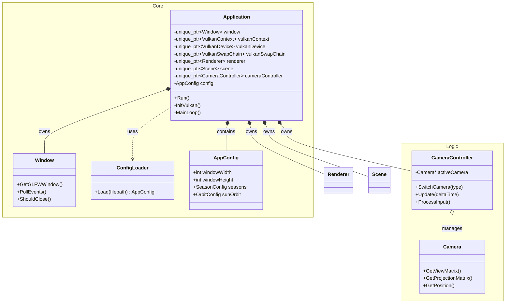
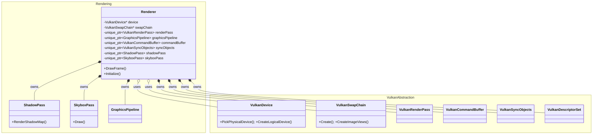
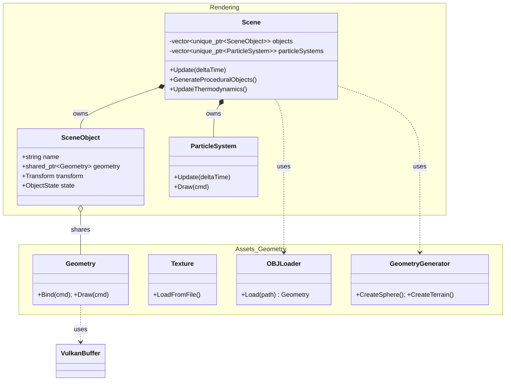
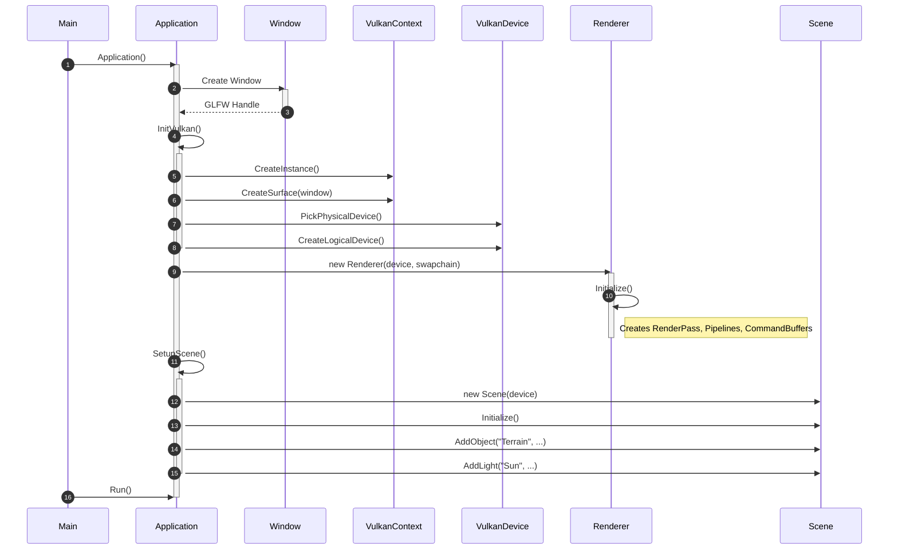
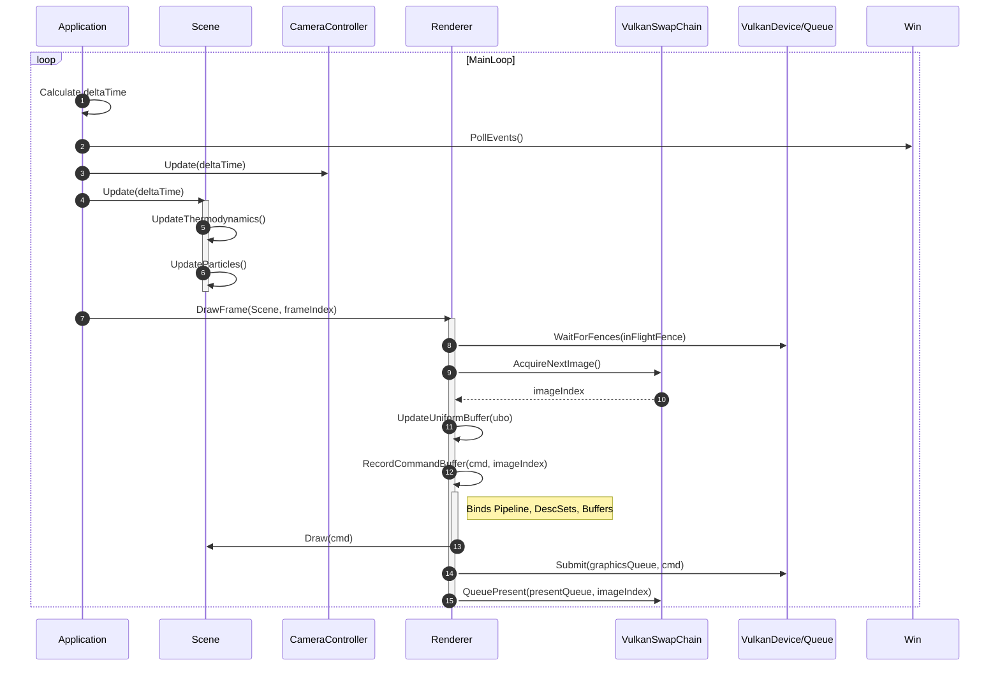

# 700106 / 700120 Lab Book

## Week 1 - Lab A

3 Oct 2025

### Q1. Hello World

**Question:**

Locate the Solution Explorer within Visual Studio and select the HelloWorld project.

Right click on this project and select Build. This should compile and link the project.

Now run the HelloWorld program.

Change between Debug and Release mode. Compile again and rerun the program.

**Solution:**

```c++
#include <iostream>

int main(int, char**) {
   std::cout << "Hello World" << std::endl;
   return 0;
}
```

**Test data:**

*Delete if not required.*

**Sample output:**

*Delete if not required.*

**Reflection:**

*Reflect on what you have learnt from this exercise.*

*Did you make any mistakes?*

*In what way has your knowledge improved?*

**Questions:**

*Is there anything you would like to ask?*

### Q2. Console Window
**Question:**
Delay the termination of the program

**Solution:**
This code will request an integer valur before terminating the program

```c++
#include <iostream>

int main(int, char**) {
   std::cout << "Hello World" << std::endl;

   int keypress;
   std::cin >> keypress;

   return 0;
}
```

**Sample output:**
```sh
Hello World

1

Press any key to close this window
```

### Q3. Includes
**Question:**
Remove the statement:
```c++
#include <iostream>
```

**Solution:**
When the statement #include <iostream> is removed and the program is compiled, the compiler will generate errors indicating that std::cout, std::cin, and std::endl are undefined. This is because these symbols are declared in the <iostream> header, which provides the standard input and output stream objects in C++. Without including this header, the compiler does not know about these objects or their associated functionality.

**Sample output:**


### Q5. Namespace 

**Question:**
Add the statement

```c++
using namespace std;
```

Compile the program. What is the effect?
Now remove all instances of the code

```c++
std::
```

Compile the program. What is the effect?
Now remove

```c++
using namespace std;
```

**Solution:**
With the *using namespace std;* included, instances of *std::* can be removed and the code will still compile. Removal of the *using* statement will result in a compiler error.

### Q7. Temperature 
**Question:**

Create a new cpp file within the temperature project and write a program to input a Fahrenheit measurement, convert it and output a Celsius value. The conversion formula is

```c++
c = 5/9 (f - 32)
```

Confirm that your conversion programme gives the correct outputs

- `32 F gives 0 C`
- `33 F gives 0.555 C`
**Solution:**
The *TruncateTo* method is used to ensure the program matches the expected output

```c++
#include <iostream>
#include <iomanip>
#include <cmath>

static double TruncateTo(double value, int decimals)
{
    double factor = std::pow(10.0, decimals);
    return std::trunc(value * factor) / factor;
}

int main()
{
    std::cout << "Enter temperature in Fahrenheit: ";
    double f;
    if (!(std::cin >> f))
    {
        std::cerr << "Invalid input.\n";
        return 1;
    }

    double c = (5.0 / 9.0) * (f - 32.0);

      double cDisplay = TruncateTo(c, 3);

    std::cout << std::fixed << std::setprecision(3)
        << f << " F = " << cDisplay << " C\n";

    return 0;
}
```

**Sample output:**
```sh
Enter temperature in Fahrenheit: 32
32.000 F = 0.000 C
```
```sh
Enter temperature in Fahrenheit: 33
33.000 F = 0.555 C
```
```sh
Enter temperature in Fahrenheit: 100
100.000 F = 37.777 C
```


### Q8. Auto, const and casting

**Question:**
Rewrite your temperature example using the auto keyword, constants and explicit casting

**Solution:**
```c++
#include <iostream>
#include <iomanip>
#include <cmath>

const int DISPLAY_DECIMALS = 3;
const double FAHRENHEIT_FREEZING = 32.0;
const double F_TO_C_SCALE = static_cast<double>(5) / 9;

static double TruncateTo(double value, int decimals)
{
    const auto factor = std::pow(10.0, static_cast<double>(decimals));
    return std::trunc(value * factor) / factor;
}

int main()
{
    std::cout << "Enter temperature in Fahrenheit: ";
    auto fahrenheit = 0.0;
    if (!(std::cin >> fahrenheit))
    {
        std::cerr << "Invalid input.\n";
        return 1;
    }

    const auto celsius = F_TO_C_SCALE * (fahrenheit - FAHRENHEIT_FREEZING);
    const auto celsiusDisplay = TruncateTo(celsius, DISPLAY_DECIMALS);

    std::cout << std::fixed << std::setprecision(DISPLAY_DECIMALS)
              << fahrenheit << " F = " << celsiusDisplay << " C\n";

    return 0;
}
```
**Reflection:**
Constant improve clarity with clear naming and grouped positioning at the top of the file.

The explicit cast used for *F_TO_C_SCALE* makes the division purpose unambiguous

Auto is used when the datatype is immediately obvious, although could reduce readability on more complex problems.


### Q9. Static Assert 

**Question:**
Create a new project call `sizeOf` that includes the following lines of code:

```c++
const int sizeOfInt = sizeof(int);
const int sizeOfPointer = sizeof(int*);
static_assert (sizeOfInt == sizeOfPointer, "Pointers and int are different sizes");
```

Select a different architecture (e.g. x86 or x64) to see if you can make the assert fail.

Experiment by adding further asserts to your program

Remember these static asserts are completely free.  The check is done at compile time, so no code is added to your solution.

**Solution:**

```c++
const int sizeOfInt = sizeof(int);
const int sizeOfPointer = sizeof(int*);
static_assert(sizeOfInt == sizeOfPointer, "Pointers and int are different sizes");

int main()
{
    return 0;
}
```


**Reflection:**
On x64, *sizeof(int)* is fixed at 4 bytes. *sizeof(int*)* is 8 bytes because pointers must hold 64-bit virtual addresses. 32-bit systems only require 4 bytes for their virtual address, meaning the *static_assert* will pass


These asserts are useful in shared or larger codebases, where the value of a constant needs to be checked during the compile time. 

```c++
const int testValue = 42;

static_assert(testValue == 42, "Someone changed the testValue");
```

## Week 2 - Lab 2
### Q1. Timing

**Question:**
Explain the impact of increasing the loop limit on the payload
```cpp
const int loopLimit = 20 -> 40

for (auto j = 0; j < loopLimit; j++) {
	dummyX = dummyX * 1.00001;
}
```
**Solution:**


Release **x64** --- Loop Limit: 20
```sh
Overhead duration: 51

Median duration: 45

Mean (80%) duration: 44.2189
```

Release **x86** --- Loop Limit: 20
```sh
Overhead duration: 51

Median duration: 37

Mean (80%) duration: 37.0099
```
##
Release **x64** --- Loop Limit: 40
```sh
Overhead duration: 50

Median duration: 73

Mean (80%) duration: 78.9634
```

Release **x86** --- Loop Limit: 40
```sh
Overhead duration: 49

Median duration: 73

Mean (80%) duration: 73.8873
```

**Reflection:**

x86 performs 18% faster than x64 with a loop limit of 20.

Both architectures perform similarly with a loop limit of 40.

The 32-bit architecture uses the x87 floating-point unit with stack-based registers, allowing compact 2-3 byte instructions for simple operations like multiplication.

The 64-bit architecture requires SSE2 instructions, which use a different encoding format with mandatory prefixes, resulting in 4-5 byte instructions. While SSE2 provides 16 XMM registers (more than x87's 8), the longer instruction encoding creates overhead for trivial loops—more bytes to fetch, more decoder work, larger code footprint.

At 20 iterations, the loop control overhead represents a larger fraction of the total execution time. The x86 compiler likely generated more efficient loop control code.

Performance converges at 40 iterations as the workload becomes large enough that both architectures spend most of their time executing floating-point multiplication, rather than fetching and decoding instructions. Once hardware execution units are saturated, the differences in encoding overhead become negligible compared to the actual compuation time. 

## 

### Q2 + 3. Timing my code (using conditionals)

**Solution:**
```cpp
auto dummyX = 1.0;
std::string dummyString = "ABCDEFGHIJKLMNOPQRSTUVWXYZ";

auto dummyCount = 0;
for (auto j = 0; j < 20; j++) {
	if (j % 2 == 0) {
		dummyX = dummyX * 1.00001;
	}
	else {
		dummyX = dummyX + 0.00001;
	}
	dummyCount++;
}
```

Release **x64** --- Loop Limit: 20
```sh
Overhead duration: 50

Median duration: 164

Mean (80%) duration: 165.073
```

Release **x86** --- Loop Limit: 20
```sh
Overhead duration: 49

Median duration: 158

Mean (80%) duration: 158.164
```
##
Release **x64** --- Loop Limit: 40
```sh
Overhead duration: 51

Median duration: 350

Mean (80%) duration: 339.162
```

Release **x86** --- Loop Limit: 40
```sh
Overhead duration: 52

Median duration: 351

Mean (80%) duration: 351.781
```

**Reflection:**

x86's compact instruction encoding provides a small performance advantage for trivial loops with 20 itreations, but this advantage disappears as hardware execution units become occupied.

The complexity of the workload detmermines bottlenecks, as the dominant performance factor moves from instruction fetch/decode overhead to actual computational work and memory allocations.

Predictable branches are effectivley handled as results suggest the regular pattern of *j % 2 == 0* is well predicted by modern CPUs, so the branch misprediction penalty is minimal. This makes the choice between conditional types largely irrelevent for deterministic patterns, unlike unpredictable branching which would show more significant performance variations.


### Q4. Branch prediction

**Question:**
Add a piece of code to the payload that demonstrates when branch prediction is working well and when branch prediction is failing.


**Solution:**

Predictable pattern (good branch prediction)
```cpp
volatile int accumulator = 0;
for (auto j = 0; j < 1000; j++) {
	if (j % 2 == 0) {
		accumulator += j;
	}
	else {
		accumulator -= j;
	}
}
dummyX = static_cast<double>(accumulator);
```

Release **x64** --- Loop Limit: 1000
```sh
Overhead duration: 76

Median duration: 4318

Mean (80%) duration: 4318.59
```
Release **x86** --- Loop Limit: 1000
```sh
Overhead duration: 76

Median duration: 4316

Mean (80%) duration: 4316.07
```

##
Unpredictable pattern (poor branch prediction), using pseudo-random Linear Congruential Generator with 50/50 branching
```cpp
volatile int accumulator = 0;
for (auto j = 0; j < 1000; j++) {
    if (((j * 1103515245 + 12345) & 0x7FFFFFFF) < 0x40000000) {
        accumulator += j;
    }
    else {
        accumulator -= j;
    }
}
dummyX = static_cast<double>(accumulator);
```
Release **x64** --- Loop Limit: 1000
```sh
Overhead duration: 78

Median duration: 3886

Mean (80%) duration: 3884.52
```

Release **x86** --- Loop Limit: 1000
```sh
Overhead duration: 76

Median duration: 3990

Mean (80%) duration: 3996.18
```


**Reflection:**
This benchmark attemped to demonstrate the performance impact of branch prediction, but the results showed the unpredictable pattern performed approximately 10% faster o nboth architectures.

These results suggest that algorithmic complexity and instruction costs can mask the potential time loss introduced by different branch predicatability


### Q5. Exiting a nested loop

**Question:**

- Two conditions in each conditional section of the loops. One for the loop control and the other as the exit condition.
- An additional if statement immediately following the inner loop to catch and propagate a break statement
- A goto statement in the inner loop
- A lambda function

Add each option to the payload section of the timing code and determine if there is any performance differences between each approach.

**Solution:**

2 Conditions
```cpp
volatile int accumulator = 0;
volatile bool exitCondition = false;
for (auto outer = 0; outer < 100 && !exitCondition; outer++) {
	for (auto inner = 0; inner < 100 && !exitCondition; inner++) {
		accumulator += outer * inner;
		if (accumulator > 25000) {
			exitCondition = true;
		}
	}
}
dummyX = static_cast<double>(accumulator);
```
x64
```sh
Overhead duration: 80

Median duration: 2112

Mean (80%) duration: 2100.93
```
x86
```sh
Overhead duration: 76

Median duration: 2044

Mean (80%) duration: 2044.36
```


Break with if
```cpp
volatile int accumulator = 0;
volatile bool shouldBreak = false;
for (auto outer = 0; outer < 100; outer++) {
	for (auto inner = 0; inner < 100; inner++) {
		accumulator += outer * inner;
		if (accumulator > 25000) {
			shouldBreak = true;
			break;
		}
	}
	if (shouldBreak) {
		break;
	}
}
dummyX = static_cast<double>(accumulator);
```
x64
```sh
Overhead duration: 76

Median duration: 1732

Mean (80%) duration: 1730.76
```
x86
```sh
Overhead duration: 76

Median duration: 1788

Mean (80%) duration: 1788.26
```

Goto Statement
```cpp
volatile int accumulator = 0;
for (auto outer = 0; outer < 100; outer++) {
	for (auto inner = 0; inner < 100; inner++) {
		accumulator += outer * inner;
		if (accumulator > 25000) {
			goto exit_loops;
		}
	}
}
exit_loops:
dummyX = static_cast<double>(accumulator);
```
x64
```sh
Overhead duration: 78

Median duration: 1712

Mean (80%) duration: 1711.22
```
x86
```sh
Overhead duration: 82

Median duration: 1760

Mean (80%) duration: 1758.9
```


Lambda Function
```cpp
volatile int accumulator = 0;
auto nestedLoop = [&accumulator]() {
	for (auto outer = 0; outer < 100; outer++) {
		for (auto inner = 0; inner < 100; inner++) {
			accumulator += outer * inner;
			if (accumulator > 25000) {
				return;
			}
		}
	}
};
nestedLoop();
dummyX = static_cast<double>(accumulator);
```
x64
```sh
Overhead duration: 82

Median duration: 1706

Mean (80%) duration: 1705.93
```
x86
```sh
Overhead duration: 78

Median duration: 1754

Mean (80%) duration: 1752.61
```
**Reflection:**

Three of the four options performed similarly, with two conditions being the slowest, due to it checking the exit condition on every iteration of both loops.

The Lambda function is preferred, due to its fast performance and modularity; however, it requires C++11 or later.

Goto has good readiblity, with direct and explicit exit intent.

Break with if has clear control flow, good performance but requires a flag variable and an extra if-check after the inner loop.


### Q1. Range based loops

**Question:**
How does performance compare to standard loops?

**Solution:**

Standard
```cpp
volatile int accumulator = 0;
std::vector<int> data(1000);
for (auto i = 0; i < 1000; i++) {
	data[i] = i;
}
for (auto i = 0; i < static_cast<int>(data.size()); i++) {
	accumulator += data[i] * 2;
}
dummyX = static_cast<double>(accumulator);
```
x64
```sh
Overhead duration: 76

Median duration: 5196

Mean (80%) duration: 5188.82
```
x86
```sh
Overhead duration: 76

Median duration: 5180

Mean (80%) duration: 5179.05
```


Range-Based
```cpp
volatile int accumulator = 0;
std::vector<int> data(1000);
auto idx = 0;
for (auto& elem : data) {
	elem = idx++;
}
for (const auto& elem : data) {
	accumulator += elem * 2;
}
dummyX = static_cast<double>(accumulator);
```
x64
```sh
Overhead duration: 76

Median duration: 5580

Mean (80%) duration: 5563.78
```
x86
```sh
Overhead duration: 76

Median duration: 5608

Mean (80%) duration: 5603.98
```
**Reflection:**

These results shows that stand index-based loops outperform range-based loops by 7-8%. The perfomance gap can be attributed to iterator overhead, pointer deferenceing in range-based loops, and the extra indirection created bu const references compared to direct array indexing.


## Week 3 - Lab C
### Q1. Debugging

**Question:**
Determine what the problem is with the program.

Suggest a solution to make the program execute correctly.
```cpp
int main(int argc, char** argv) {
	
	std::cout << "Enter a list of integers, and terminating with a letter" << std::endl;

	int value;
	auto equals1 = 0u;
	auto equals2 = 0u;
	auto equals3 = 0u;

	while (std::cin >> value) {
		switch (value) {
			case 1: equals1++;
			case 2: equals2++;
			case 3: equals3++;
			default:;
		}
	}
	std::cin.clear();

	char endOfInput;
	std::cin >> endOfInput;

	std::cout << equals1 << " inputs equals 1" << std::endl;
	std::cout << equals2 << " inputs equals 2" << std::endl;
	std::cout << equals3 << " inputs equals 3" << std::endl;

	return 0;
}
```

**Solution:**
The streamed input is being read as a single int, instead of character-by-character.

This can be solved by streaming each character individually and converting it to an int, which is achieved by subtracting '0' from the char value, where '0' has an ASCII value of 48, '1' has a value of 49, '2' is 50, etc. 

This means that int('5' - '0') == int(53 - 48) == int(5)

Breaks are added at the end of each statement to prevent fall-through


```cpp
int main(int argc, char** argv) {
	
	std::cout << "Enter a list of integers, and terminating with a letter" << std::endl;

	char ch;
	auto equals1 = 0u;
	auto equals2 = 0u;
	auto equals3 = 0u;

	while (std::cin >> ch) {
		if (!isdigit(ch)) {
			break;
		}
		int value = ch - '0';
		switch (value) {
			case 1: equals1++; break;
			case 2: equals2++; break;
			case 3: equals3++; break;
			default:;
		}
	}

	std::cout << equals1 << " inputs equals 1" << std::endl;
	std::cout << equals2 << " inputs equals 2" << std::endl;
	std::cout << equals3 << " inputs equals 3" << std::endl;

	return 0;
}
```   
##

### Q2. Bitwise 

**Question:**
Write a program to read four separate 32-bit integers (red, green, blue, and alpha) and encode them into a single 32-bit value. Output this 32-bit value. Verify that the results are correct by taking the 32-bit value and extracting and outputting the separate integers.

**Solution:**
```cpp
#include <iostream>
#include <bitset>
#include <iomanip>

int main()
{
    auto red = 255u;
    auto green = 128u;
    auto blue = 64u;
    auto alpha = 200u;

    std::cout << "Input values:" << std::endl;
    std::cout << "Red: " << red << std::endl;
    std::cout << "Green: " << green << std::endl;
    std::cout << "Blue: " << blue << std::endl;
    std::cout << "Alpha: " << alpha << std::endl;

    auto encoded = (alpha << 24) | (red << 16) | (green << 8) | blue;

    std::cout << "\nEncoded value:" << std::endl;
    std::cout << "Decimal: " << encoded << std::endl;
    std::cout << "Hex: 0x" << std::hex << std::setw(8) << std::setfill('0') << encoded << std::endl;
    std::cout << "Binary: " << std::bitset<32>(encoded) << std::endl;

    auto decoded_alpha = (encoded >> 24) & 0xFF;
    auto decoded_red = (encoded >> 16) & 0xFF;
    auto decoded_green = (encoded >> 8) & 0xFF;
    auto decoded_blue = encoded & 0xFF;

    std::cout << "\nDecoded values:" << std::dec << std::endl;
    std::cout << "Red: " << decoded_red << std::endl;
    std::cout << "Green: " << decoded_green << std::endl;
    std::cout << "Blue: " << decoded_blue << std::endl;
    std::cout << "Alpha: " << decoded_alpha << std::endl;

    std::cout << "\nVerification:" << std::endl;
    if (red == decoded_red && green == decoded_green &&
        blue == decoded_blue && alpha == decoded_alpha)
    {
        std::cout << "SUCCESS: All values match!" << std::endl;
    }
    else
    {
        std::cout << "ERROR: Values do not match!" << std::endl;
    }

    return 0;
}
```
The RGBA values are defined as unsigned ints at the start of the program, where they are combined in the *encoded* variable.

The values are shifted and put in a single variable, allowing for 4 ints to be stored in a single 32-bit value.

```
alpha = 200 (0x000000C8) << 24 = 0xC8000000
red   = 255 (0x000000FF) << 16 = 0x00FF0000
green = 128 (0x00000080) << 8  = 0x00008000
blue  = 64  (0x00000040)       = 0x00000040
+++++++++++++++++++++++++++++++++++++++++++
Final Encoded Value			   = 0xC8FF8040  

```
The 4 ints can be retrieved by shifting the *encoded* variable back by the same amounts.
```sh
Input values:
Red: 255
Green: 128
Blue: 64
Alpha: 200

Encoded value:
Decimal: 3372187712
Hex: 0xc8ff8040
Binary: 11001000111111111000000001000000

Decoded values:
Red: 255
Green: 128
Blue: 64
Alpha: 200

Verification:
SUCCESS: All values match!
```


##
### Q3. Parsing

**Question:**
Modify the program to make the loop structures more efficient and easier to maintain.
```cpp
for (line = 1; !fin.eof() && !found; line++) {

	char lineBuffer[100];
	fin.getline(lineBuffer, sizeof(lineBuffer));
	const auto lengthOfLine = static_cast<int>(fin.gcount());

	std::istrstream sin(lineBuffer, lengthOfLine - 1);  

	std::string word;
	for (position = 1; (sin >> word) && !found && !((word[0] == '/') && (word[1] == '/')); position++) {
		if (word == variable) {
			found = true;
		}
	}
}
```

**Solution:**

In order to evaluate efficiency, the timing code is used from Lab B. 

Any user input, file streaming or varible assignment is done outside of the loop.

```cpp
std::string variable;
std::cout << "Enter a search variable" << std::endl;
std::cin >> variable;

std::ifstream fin("sample.txt");
if (!fin) {
	std::cerr << "Error: Could not open sample.txt" << std::endl;
	return -1;
}

auto found = false;
auto position = -1;
int line;

// ... timing code setup ...
```

After each completed iteration, the position of the reader within *sample.txt* must be reset, as well as the EOF and *found* flag. 

```cpp
fin.clear();                    // Clear 'End of File' flag -- fin.eof()
fin.seekg(0, std::ios::beg);    // Seekget position, 0 bit offset, from beginning

found = false;                   // Reset found flag
```

The provided code performed as follows:

*aaaaaa* - not in file
```
Number of iterations: 250000

Overhead duration: 50

Median duration: 41649

Mean (80%) duration: 41569.1

aaaaaa does not appear in the file

```
*return* - in file
```
Number of iterations: 250000

Overhead duration: 50

Median duration: 38022

Mean (80%) duration: 37971.8

return appears as the 1 word on line number 9

```
##
This optimised solution keeps the same loop structure, but explicitly defines an early exit when the word is found and when a blank line is read.

It also prevents out-of-bounds access when checking for comments by verifying that *word.length() >= 2* before accessing *word[1]*.
```cpp
for (line = 1; !fin.eof() && !found; line++) {

	char lineBuffer[100];
	fin.getline(lineBuffer, sizeof(lineBuffer));
	const auto lengthOfLine = static_cast<int>(fin.gcount());

	if (lengthOfLine <= 1) continue;

	std::istrstream sin(lineBuffer, lengthOfLine - 1);

	std::string word;
	for (position = 1; (sin >> word) && !found; position++) {
		if (word.length() >= 2 && word[0] == '/' && word[1] == '/') {
			break;
		}

		if (word == variable) {
			found = true;
			break;
		}
	}
}
```

*aaaaaa* - not in file
```
Number of iterations: 250000

Overhead duration: 50

Median duration: 39626

Mean (80%) duration: 39796.4

aaaaaa does not appear in the file

```

*return* - in file
```
Number of iterations: 250000

Overhead duration: 49

Median duration: 36640

Mean (80%) duration: 36412.8

return appears as the 1 word on line number 9
```

##
### Q3. Quadratic

**Question:**
Modify the quadratic program to:

- Handle equal or imaginary roots
- Output the roots to only 3 decimal places
- Add an enum to store whether there is one root, two roots or imaginary roots.

Add the new code to the timing project (not the input or output code), and try to improve the program's efficiency.


**Solution:**
```cpp
enum class RootType {
	OneRoot,
	TwoRoots,
	ImaginaryRoots
};

int main(int argc, char** argv) {
	std::cout << "Enter the coefficients for a quadratic equation (a b c)" << std::endl;
	double a, b, c;
	std::cin >> a >> b >> c;

	const auto discriminant = b * b - 4.0 * a * c;
	RootType rootType;

	std::cout << std::fixed << std::setprecision(3);

	std::cout << "The roots of the equation "
		<< a << "x^2 + " << b << "x + " << c << "\n";

	if (discriminant > 0) {
		rootType = RootType::TwoRoots;
		const auto root1 = (-b + sqrt(discriminant)) / (2.0 * a);
		const auto root2 = (-b - sqrt(discriminant)) / (2.0 * a);
		std::cout << "are " << root1 << " and " << root2 << std::endl;
	}
	else if (discriminant == 0) {
		rootType = RootType::OneRoot;
		const auto root = -b / (2.0 * a);
		std::cout << "has one repeated root: " << root << std::endl;
	}
	else {
		rootType = RootType::ImaginaryRoots;
		const auto realPart = -b / (2.0 * a);
		const auto imaginaryPart = sqrt(-discriminant) / (2.0 * a);
		std::cout << "are " << realPart << " + " << imaginaryPart << "i and "
			<< realPart << " - " << imaginaryPart << "i" << std::endl;
	}

	return 0;
}
```

Performance testing

```cpp
enum class RootType {
	OneRoot,
	TwoRoots,
	ImaginaryRoots
};

int main(int argc, char** argv) {

	// START playload setup

	std::cout << "Enter the coefficients for a quadratic equation (a b c)" << std::endl;
	double a, b, c;
	std::cin >> a >> b >> c;

	RootType rootType;

	std::cout << std::fixed << std::setprecision(3);

	std::cout << "The roots of the equation "
		<< a << "x^2 + " << b << "x + " << c << "\n";

	auto root1 = 0.0;
	auto root2 = 0.0;
	auto root = 0.0;
	auto realPart = 0.0;
	auto imaginaryPart = 0.0;


	// END playload setup

// ... timing code setup ...

	for (auto i = 0; i < numOfIterations; i++) {
		const auto startTime = c_ext_getCPUClock();

		// BEGIN payload
		const auto discriminant = b * b - 4.0 * a * c;

		if (discriminant > 0) {
			rootType = RootType::TwoRoots;
			root1 = (-b + sqrt(discriminant)) / (2.0 * a);
			root2 = (-b - sqrt(discriminant)) / (2.0 * a);
		}
		else if (discriminant == 0) {
			rootType = RootType::OneRoot;
			root = -b / (2.0 * a);
		}
		else {
			rootType = RootType::ImaginaryRoots;
			realPart = -b / (2.0 * a);
			imaginaryPart = sqrt(-discriminant) / (2.0 * a);

		}

		// END payload

		const auto stopTime = c_ext_getCPUClock();
		const auto duration = static_cast<int>(stopTime - startTime - overhead);
		experimentTimes.push_back(duration > 0 ? duration : 1);
	}

	// OUTPUT results
	if (rootType == RootType::TwoRoots)
		std::cout << "are " << root1 << " and " << root2 << std::endl;
	else if (rootType == RootType::OneRoot)
		std::cout << "has one repeated root: " << root << std::endl;
	else
		std::cout << "are " << realPart << " + " << imaginaryPart << "i and "
		<< realPart << " - " << imaginaryPart << "i" << std::endl;

```

TwoRoots: 2 -3 1
```
Overhead duration: 78

Median duration: 36

Mean (80%) duration: 36.779
```

OneRoot: 4 4 1
```
Overhead duration: 78

Median duration: 14

Mean (80%) duration: 14.263
```

ImaginaryRoots: 2 1 3
```
Overhead duration: 78

Median duration: 36

Mean (80%) duration: 36.679
```
##
Optimisations were made in this solution by reducing the number of repeated calcualtions, by caching twoA, negB and
```cpp
const auto discriminant = b * b - 4.0 * a * c;

const auto twoA = 2.0 * a;        
const auto negB = -b;              

if (discriminant > 0) {
	rootType = RootType::TwoRoots;
	const auto sqrtDisc = sqrt(discriminant);  
	root1 = (negB + sqrtDisc) / twoA;
	root2 = (negB - sqrtDisc) / twoA;
}
else if (discriminant == 0) {
	rootType = RootType::OneRoot;
	root = negB / twoA;
}
else {
	rootType = RootType::ImaginaryRoots;
	realPart = negB / twoA;
	imaginaryPart = sqrt(-discriminant) / twoA;
}
```

TwoRoots: 2 -3 1
```
Overhead duration: 78

Median duration: 34

Mean (80%) duration: 33.284
```

OneRoot: 4 4 1
```
Overhead duration: 78

Median duration: 14

Mean (80%) duration: 13.400
```

ImaginaryRoots: 2 1 3
```
Overhead duration: 78

Median duration: 36

Mean (80%) duration: 35.313
```


##
### Q3. Assembly Optimiser

The compiler keeps all critical values in SSE registers (xmm).
- xmm7 = b
- xmm8 = a (then twoA)
- xmm1 = discriminant
- xmm15 = constant 4.0
- xmm12 = sign bit mask (for negation via XOR)

Instead of multiplying by -1, the compiler uses xorps (XOR) to flip the sign bit.

The compiler uses SIMD square root (sqrtpd) instead of calling the sqrt() function


```cpp
		// BEGIN payload
		const auto discriminant = b * b - 4.0 * a * c;
00007FF6DBB814F8  movsd       xmm7,mmword ptr [b]  
00007FF6DBB814FE  movaps      xmm1,xmm7  
00007FF6DBB81501  mulsd       xmm1,xmm7  
00007FF6DBB81505  movsd       xmm8,mmword ptr [rbp-80h]  
00007FF6DBB8150B  movaps      xmm0,xmm8  
00007FF6DBB8150F  mulsd       xmm0,xmm15  
00007FF6DBB81514  mulsd       xmm0,mmword ptr [rbp-78h]  
00007FF6DBB81519  subsd       xmm1,xmm0  

		const auto twoA = 2.0 * a;        
00007FF6DBB8151D  mulsd       xmm8,mmword ptr [__real@4000000000000000 (07FF6DBB84610h)]  
		const auto negB = -b;              
00007FF6DBB81526  xorps       xmm7,xmm12  

		if (discriminant > 0) {
00007FF6DBB8152A  comisd      xmm1,xmm6  
00007FF6DBB8152E  jbe         main+3AAh (07FF6DBB8156Ah)  
			rootType = RootType::TwoRoots;
00007FF6DBB81530  mov         ebx,1  
00007FF6DBB81535  xorps       xmm0,xmm0  
			const auto sqrtDisc = sqrt(discriminant);  
00007FF6DBB81538  ucomisd     xmm0,xmm1  
00007FF6DBB8153C  ja          main+384h (07FF6DBB81544h)  
00007FF6DBB8153E  sqrtpd      xmm0,xmm1  
00007FF6DBB81542  jmp         main+38Ch (07FF6DBB8154Ch)  
00007FF6DBB81544  movaps      xmm0,xmm1  
00007FF6DBB81547  call        sqrt (07FF6DBB8359Eh)  
			root1 = (negB + sqrtDisc) / twoA;
00007FF6DBB8154C  movaps      xmm9,xmm0  
00007FF6DBB81550  addsd       xmm9,xmm7  
00007FF6DBB81555  divsd       xmm9,xmm8  
			root2 = (negB - sqrtDisc) / twoA;
00007FF6DBB8155A  movaps      xmm10,xmm7  
00007FF6DBB8155E  subsd       xmm10,xmm0  
00007FF6DBB81563  divsd       xmm10,xmm8  
		}
00007FF6DBB81568  jmp         main+3F2h (07FF6DBB815B2h)  
		else if (discriminant == 0) {
00007FF6DBB8156A  divsd       xmm7,xmm8  
00007FF6DBB8156F  ucomisd     xmm1,xmm6  
00007FF6DBB81573  jp          main+3C0h (07FF6DBB81580h)  
00007FF6DBB81575  jne         main+3C0h (07FF6DBB81580h)  
			rootType = RootType::OneRoot;
00007FF6DBB81577  mov         ebx,r13d  
			root = negB / twoA;
00007FF6DBB8157A  movaps      xmm13,xmm7  
		}
00007FF6DBB8157E  jmp         main+3F2h (07FF6DBB815B2h)  
		else {
			rootType = RootType::ImaginaryRoots;
00007FF6DBB81580  mov         ebx,2  
			realPart = negB / twoA;
00007FF6DBB81585  movaps      xmm14,xmm7  
			imaginaryPart = sqrt(-discriminant) / twoA;
00007FF6DBB81589  xorps       xmm1,xmm12  
00007FF6DBB8158D  xorps       xmm0,xmm0  
00007FF6DBB81590  ucomisd     xmm0,xmm1  
00007FF6DBB81594  ja          main+3E1h (07FF6DBB815A1h)  
00007FF6DBB81596  xorps       xmm11,xmm11  
00007FF6DBB8159A  sqrtsd      xmm11,xmm1  
00007FF6DBB8159F  jmp         main+3EDh (07FF6DBB815ADh)  
00007FF6DBB815A1  movaps      xmm0,xmm1  
00007FF6DBB815A4  call        sqrt (07FF6DBB8359Eh)  
00007FF6DBB815A9  movaps      xmm11,xmm0  
00007FF6DBB815AD  divsd       xmm11,xmm8  
		}
		// END payload
```


## Week 4 - Lab D 
### Q1. Object Parser

**Question:**
- Parse the file and store the vertices, textures, normals, and faces in separate arrays.
- Ignore comments and any other lines that do not match the format.
- Verify that the data is correctly parsed by printing the contents of the arrays.
- The program should be able to parse multiple objects in the file.

**Solution:**
if-else statements are used to store values in their respective vector.
```cpp
while (std::getline(fin, line)) {
	std::stringstream ss(line);
	std::string tag;

	if (!(ss >> tag)) continue;

	if (tag == "o") {
		ss >> currentObject;
		fout << "Parsing Object: " << currentObject << std::endl;
	}
	else if (tag == "v") {
		Vertex v;
		ss >> v.x >> v.y >> v.z;
		vertices.push_back(v);
	}
	else if (tag == "vt") {
		Texture t;
		ss >> t.u >> t.v;
		textures.push_back(t);
	}
	else if (tag == "vn") {
		Normal n;
		ss >> n.x >> n.y >> n.z;
		normals.push_back(n);
	}
```

Face values are stored in a struct using a while loop, which reads each *v / vt / vm* group from the line and uses *stringstream* to parse the indicies.
```cpp
struct Face {
	std::vector<int> vertexIndices;
	std::vector<int> textureIndices;
	std::vector<int> normalIndices;
};

[...]

else if (tag == "f") {
	Face f;
	std::string face_vertex_str;


	while (ss >> face_vertex_str) {
		std::stringstream face_ss(face_vertex_str);
		int v_idx = 0, vt_idx = 0, vn_idx = 0; 
		char slash; 

		face_ss >> v_idx >> slash >> vt_idx >> slash >> vn_idx;

		if (!face_ss.fail()) {
			// OBJ is 1-indexed, convert to 0-indexed for C++
			f.vertexIndices.push_back(v_idx - 1);
			f.textureIndices.push_back(vt_idx - 1);
			f.normalIndices.push_back(vn_idx - 1);
		}
	}
	faces.push_back(f);
}
```


### Q2. 

**Question:**


**Solution:**
The Object struct stores the name and faces of an object, which can then be stored in a vector of objects.

The vertices, textures and normals are all stored in a single vector.

When an object tag is read, a new object is created.
```cpp
if (tag == "o") {
	Object newObject;
	ss >> newObject.name;
	allObjects.push_back(newObject);
	fout << "Parsing Object: " << newObject.name << std::endl;
}
```
When a a new face is read, it is pushed onto the last object
```cpp
else if (tag == "f") {

	if (allObjects.empty()) {
		allObjects.push_back(Object{ "DefaultObject" });
		fout << "Parsing Object: DefaultObject" << std::endl;
	}

	Face f;
	std::string face_vertex_str;

	while (ss >> face_vertex_str) {
		std::stringstream face_ss(face_vertex_str);
		int v_idx = 0, vt_idx = 0, vn_idx = 0; 
		char slash;

		face_ss >> v_idx >> slash >> vt_idx >> slash >> vn_idx;

		if (!face_ss.fail()) {
			f.vertexIndices.push_back(v_idx - 1);
			f.textureIndices.push_back(vt_idx - 1);
			f.normalIndices.push_back(vn_idx - 1);
		}
	}
	allObjects.back().faces.push_back(f);
}
```

### Q3. Tuples 

**Question:**
Select one of your object parsers and wrap the code within a new function. This new function has a single parameter, the file name, and returns a tuple consisting of the size of the largest object and the level of the largest object.

**Solution:**
The parsing logic is now included in the *getLargestObjectStats* function, which returns the size and level of the largest object
```cpp
std::tuple<size_t, int> getLargestObjectStats(const std::string& filename) {

[... existing logic ...]

	size_t largestSize = 0;
	int largestLevel = 0; 

	for (int i = 0; i < allObjects.size(); ++i) {
		if (allObjects[i].faces.size() > largestSize) {
			largestSize = allObjects[i].faces.size();
			largestLevel = i + 1; 
		}
	}

	return std::make_tuple(largestSize, largestLevel);
}
```

```cpp
// main
std::cout << "Parsing file: " << inputFile << "..." << std::endl;

auto statsTuple = getLargestObjectStats(inputFile);
size_t size = std::get<0>(statsTuple);
int level = std::get<1>(statsTuple);
```


### Q4. Span and Arrays

**Question:**
Create a second version that uses the array template, which wraps a vanilla C array within a C++11 template.

Create a third version of this function that uses the C++20 span to pass the array to the function. span removes the need for the second parameter.

**Solution:**
Main creates and fills a C-style array, then creates a copy of the data into a standard array.
```cpp
int cStyleArray[numOfValues];
	std::srand(static_cast<unsigned int>(time(nullptr)));
	for (auto i = 0u; i < numOfValues; i++) {
		cStyleArray[i] = std::rand();
	}

std::array<int, numOfValues> stdArray;
std::copy(std::begin(cStyleArray), std::end(cStyleArray), stdArray.begin());

const auto largestV1 = findLargestValueV1(cStyleArray, numOfValues);
std::cout << "V1 (C-style array): " << largestV1 << std::endl;

const auto largestV2 = findLargestValueV2(stdArray);
std::cout << "V2 (std::array):    " << largestV2 << std::endl;

const auto largestV3_c = findLargestValueV3(cStyleArray);
std::cout << "V3 (from C-style):  " << largestV3_c << std::endl;

const auto largestV3_std = findLargestValueV3(stdArray);
std::cout << "V3 (from std::array): " << largestV3_std << std::endl;
```
This function is a template to accept array of any size, where the size is part of the type.
```cpp
template <std::size_t N>
int findLargestValueV2(const std::array<int, N>& listOfValues) {

	if (listOfValues.empty())
		return std::numeric_limits<int>::min();

	auto largestValue = listOfValues[0];
	for (int currentValue : listOfValues) { 
		if (currentValue > largestValue)
			largestValue = currentValue;
	}
	return largestValue;
}
```
This function takes a span, which is a non-owning view of a contiguous sequence of data.
It works for C-style arrays, standard arrays and standard vectors.
```cpp
int findLargestValueV3(std::span<const int> listOfValues) {

	if (listOfValues.empty())
		return std::numeric_limits<int>::min();

	auto largestValue = listOfValues[0];
	for (int currentValue : listOfValues) {
		if (currentValue > largestValue)
			largestValue = currentValue;
	}
	return largestValue;
}
```


## Week 5 - Lab E
### Q1. Basic vectors

**Question:**
Add the following new methods:

- Vector product (i.e. cross product)
- Scalar product (i.e. dot product)

Add new methods which overload the following binary operators:

- `+` vector addition
- `-` vector subtraction
- `*` scalar product
- `^` vector product
- `+=` vector addition
- `-=` vector subtraction
- `<<` stream out
- `>>` stream in

Add new methods which overload the following unary operators:

- `-` vector inversion (reverse the vector)

Now that you have 3 methods to add two vectors, use the timing code from early labs to analyse the performance of each implementation.

**Solution:**

Vector3d.h
```cpp
	//-------------------------------------------------------------------------
	// Product operations
	//-------------------------------------------------------------------------

	// Scalar product (dot product). Returns the dot product of two vectors
	double dot(const Vector3d& v) const { return _x * v._x + _y * v._y + _z * v._z; }

	// Vector product (cross product). Returns the cross product of two vectors
	Vector3d cross(const Vector3d& v) const;

	//-------------------------------------------------------------------------
	// Operator overloads - Binary operators
	//-------------------------------------------------------------------------

	// Vector addition operator
	Vector3d operator + (const Vector3d& v) const { return add(v); }

	// Vector subtraction operator
	Vector3d operator - (const Vector3d& v) const { return subtract(v); }

	// Scalar product operator (dot product)
	double operator * (const Vector3d& v) const { return dot(v); }

	// Vector product operator (cross product)
	Vector3d operator ^ (const Vector3d& v) const { return cross(v); }

	// Vector addition assignment operator
	Vector3d& operator += (const Vector3d& v);

	// Vector subtraction assignment operator
	Vector3d& operator -= (const Vector3d& v);

	//-------------------------------------------------------------------------
	// Operator overloads - Unary operators
	//-------------------------------------------------------------------------

	// Vector inversion (negation) operator. Returns a vector pointing in the opposite direction
	Vector3d operator - () const { return { -_x, -_y, -_z }; }
};

//-------------------------------------------------------------------------
// Stream operators (non-member functions)
//-------------------------------------------------------------------------

// Stream output operator
std::ostream& operator << (std::ostream& os, const Vector3d& v);

// Stream input operator
std::istream& operator >> (std::istream& is, Vector3d& v);
```

Vector3d.cpp
```cpp
Vector3d Vector3d::cross(const Vector3d& v) const {
	return {
		_y * v._z - _z * v._y,
		_z * v._x - _x * v._z,
		_x * v._y - _y * v._x
	};
}

Vector3d& Vector3d::operator += (const Vector3d& v) {
	_x += v._x;
	_y += v._y;
	_z += v._z;
	return *this;
}

Vector3d& Vector3d::operator -= (const Vector3d& v) {
	_x -= v._x;
	_y -= v._y;
	_z -= v._z;
	return *this;
}

std::ostream& operator << (std::ostream& os, const Vector3d& v) {
	os << "(" << v._x << ", " << v._y << ", " << v._z << ")";
	return os;
}

std::istream& operator >> (std::istream& is, Vector3d& v) {
	is >> v._x >> v._y >> v._z;
	return is;
}
```
##
Timings were consistantly between 1.0 - 1.6 across all implementations.
<table>
<tr>
<th>Code</th>
<th>Output</th>
</tr>
<tr>
<td>

```cpp
const Vector3d a(1,2,3);
const Vector3d b(3,4,5);

const auto c = a.add(b);
```
</td>
<td>

```
Overhead duration: 76

Median duration: 2

Mean (80%) duration: 1.54729
```
</td>
</tr>
<tr>
<td>

```cpp
const Vector3d a(1,2,3);
const Vector3d b(3,4,5);

const auto c = a + b;
```
</td>
<td>

```
Overhead duration: 76

Median duration: 2

Mean (80%) duration: 1.55469
```
</td>
</tr>
<tr>
<td>

```cpp
Vector3d a(1,2,3);
const Vector3d b(3,4,5);

a += b;
```
</td>
<td>

```
Overhead duration: 76

Median duration: 2

Mean (80%) duration: 1.55621
```
</td>
</tr>
</table>


##
### Q2. Commutativity

**Question:**
Implement both a standard method and overload the `*` operator to multiply a vector by a single double.

Also implement the multiplication of a single double by a vector.

Why is this last requirement more problematic than the preceding requirement?

**Solution:**

Vector3d.h
```cpp
// Scalar multiplication. Multiplies vector by a scalar value
Vector3d scale(const double scalar) const { return { _x * scalar, _y * scalar, _z * scalar }; }
// Scalar multiplication assignment operator
Vector3d& operator *= (const double scalar);
```
```cpp
// Scalar multiplication operator - scalar * vector
// This must be a non-member function because the left operand is a double, not a Vector3d
Vector3d operator * (const double scalar, const Vector3d& v);
```

Vector3d.cpp
```cpp
Vector3d& Vector3d::operator *= (const double scalar) {
	_x *= scalar;
	_y *= scalar;
	_z *= scalar;
	return *this;
}


Vector3d operator * (const double scalar, const Vector3d& v) {
	return v.scale(scalar);
}
```
**Reflection:**

__vector * double__  can be a member function 
```cpp
Vector3d::operator*(double)
```
__double * vector__ cannot, because the left operand is a data type, not a class type.
```cpp
double::operator*(Vector3d) (NOT POSSIBLE)

Vector3d operator* (double, vector);
```

##
### Q3. Matrices

**Question:**

Complete the `Matrxix33d` class.

Functionality to be included:

- Addition
- Subtraction
- Multiplication
- Streaming in and out
- Inverse
- Transpose

**Solution:**

Matrix33d.h
```cpp

	Matrix33d(const Vector3d& row0, const Vector3d& row1, const Vector3d& row2) {
		_row[0] = row0;
		_row[1] = row1;
		_row[2] = row2;
	}

	const Vector3d& row(int index) const { return _row[index]; }
	Vector3d& row(int index) { return _row[index]; }

	double get(int i, int j) const {
		return (j == 0) ? _row[i]._x : (j == 1) ? _row[i]._y : _row[i]._z;
	}

	void set(int i, int j, double value) {
		if (j == 0) _row[i]._x = value;
		else if (j == 1) _row[i]._y = value;
		else _row[i]._z = value;
	}

	Matrix33d add(const Matrix33d& m) const {
		return Matrix33d(
			_row[0].add(m._row[0]),
			_row[1].add(m._row[1]),
			_row[2].add(m._row[2])
		);
	}

	Matrix33d subtract(const Matrix33d& m) const {
		return Matrix33d(
			_row[0].subtract(m._row[0]),
			_row[1].subtract(m._row[1]),
			_row[2].subtract(m._row[2])
		);
	}

	Matrix33d multiply(const Matrix33d& m) const;

	Matrix33d transpose() const;
	double determinant() const;
	Matrix33d inverse() const;
	bool isIdentity(double tolerance = _epsilon) const;

	Matrix33d operator + (const Matrix33d& m) const { return add(m); }
	Matrix33d operator - (const Matrix33d& m) const { return subtract(m); }
	Matrix33d operator * (const Matrix33d& m) const { return multiply(m); }
	Vector3d operator * (const Vector3d& v) const;
	Matrix33d& operator += (const Matrix33d& m);
	Matrix33d& operator -= (const Matrix33d& m);
	Matrix33d& operator *= (const Matrix33d& m);
	bool operator == (const Matrix33d& m) const;
	bool operator != (const Matrix33d& m) const { return !(*this == m); }

	static Matrix33d identity() {
		Matrix33d m;
		m._row[0] = Vector3d(1, 0, 0);
		m._row[1] = Vector3d(0, 1, 0);
		m._row[2] = Vector3d(0, 0, 1);
		return m;
	}

	static Matrix33d zero() {
		return Matrix33d();
	}
};

std::ostream& operator << (std::ostream& os, const Matrix33d& m);

std::istream& operator >> (std::istream& is, Matrix33d& m);
```

Matrix33d.h
```cpp
#include "Matrix33d.h"
#include <cmath>
#include <ostream>
#include <istream>


Matrix33d Matrix33d::multiply(const Matrix33d& m) const {
	Matrix33d result;

	// Standard matrix multiplication: result[i][j] = sum(this[i][k] * m[k][j])
	for (int i = 0; i < 3; i++) {
		for (int j = 0; j < 3; j++) {
			double sum = 0.0;
			for (int k = 0; k < 3; k++) {
				sum += get(i, k) * m.get(k, j);
			}
			result.set(i, j, sum);
		}
	}

	return result;
}


Matrix33d Matrix33d::transpose() const {
	Matrix33d result;

	// Swap rows and columns
	for (int i = 0; i < 3; i++) {
		for (int j = 0; j < 3; j++) {
			result.set(j, i, get(i, j));
		}
	}

	return result;
}


double Matrix33d::determinant() const {
	// Calculate determinant using the rule of Sarrus
	// det = a11(a22*a33 - a23*a32) - a12(a21*a33 - a23*a31) + a13(a21*a32 - a22*a31)

	const double a11 = _row[0]._x, a12 = _row[0]._y, a13 = _row[0]._z;
	const double a21 = _row[1]._x, a22 = _row[1]._y, a23 = _row[1]._z;
	const double a31 = _row[2]._x, a32 = _row[2]._y, a33 = _row[2]._z;

	return a11 * (a22 * a33 - a23 * a32)
		- a12 * (a21 * a33 - a23 * a31)
		+ a13 * (a21 * a32 - a22 * a31);
}


Matrix33d Matrix33d::inverse() const {
	const double det = determinant();

	// Check if matrix is singular (non-invertible)
	if (fabs(det) < _epsilon) {
		// Return zero matrix for singular matrices
		return Matrix33d::zero();
	}

	const double invDet = 1.0 / det;

	// Extract elements for clarity
	const double a11 = _row[0]._x, a12 = _row[0]._y, a13 = _row[0]._z;
	const double a21 = _row[1]._x, a22 = _row[1]._y, a23 = _row[1]._z;
	const double a31 = _row[2]._x, a32 = _row[2]._y, a33 = _row[2]._z;

	// Calculate cofactor matrix and transpose (adjugate matrix)
	Matrix33d result;

	result._row[0]._x = (a22 * a33 - a23 * a32) * invDet;
	result._row[0]._y = (a13 * a32 - a12 * a33) * invDet;
	result._row[0]._z = (a12 * a23 - a13 * a22) * invDet;

	result._row[1]._x = (a23 * a31 - a21 * a33) * invDet;
	result._row[1]._y = (a11 * a33 - a13 * a31) * invDet;
	result._row[1]._z = (a13 * a21 - a11 * a23) * invDet;

	result._row[2]._x = (a21 * a32 - a22 * a31) * invDet;
	result._row[2]._y = (a12 * a31 - a11 * a32) * invDet;
	result._row[2]._z = (a11 * a22 - a12 * a21) * invDet;

	return result;
}


bool Matrix33d::isIdentity(double tolerance) const {
	// Check diagonal elements are 1
	if (fabs(_row[0]._x - 1.0) > tolerance) return false;
	if (fabs(_row[1]._y - 1.0) > tolerance) return false;
	if (fabs(_row[2]._z - 1.0) > tolerance) return false;

	// Check off-diagonal elements are 0
	if (fabs(_row[0]._y) > tolerance) return false;
	if (fabs(_row[0]._z) > tolerance) return false;
	if (fabs(_row[1]._x) > tolerance) return false;
	if (fabs(_row[1]._z) > tolerance) return false;
	if (fabs(_row[2]._x) > tolerance) return false;
	if (fabs(_row[2]._y) > tolerance) return false;

	return true;
}


Vector3d Matrix33d::operator * (const Vector3d& v) const {
	// Matrix-vector multiplication: result = M * v
	return Vector3d(
		_row[0]._x * v._x + _row[0]._y * v._y + _row[0]._z * v._z,
		_row[1]._x * v._x + _row[1]._y * v._y + _row[1]._z * v._z,
		_row[2]._x * v._x + _row[2]._y * v._y + _row[2]._z * v._z
	);
}


Matrix33d& Matrix33d::operator += (const Matrix33d& m) {
	_row[0] = _row[0].add(m._row[0]);
	_row[1] = _row[1].add(m._row[1]);
	_row[2] = _row[2].add(m._row[2]);
	return *this;
}


Matrix33d& Matrix33d::operator -= (const Matrix33d& m) {
	_row[0] = _row[0].subtract(m._row[0]);
	_row[1] = _row[1].subtract(m._row[1]);
	_row[2] = _row[2].subtract(m._row[2]);
	return *this;
}


Matrix33d& Matrix33d::operator *= (const Matrix33d& m) {
	*this = multiply(m);
	return *this;
}


bool Matrix33d::operator == (const Matrix33d& m) const {
	return _row[0].isEqual(m._row[0])
		&& _row[1].isEqual(m._row[1])
		&& _row[2].isEqual(m._row[2]);
}


std::ostream& operator << (std::ostream& os, const Matrix33d& m) {
	os << "[ " << m.row(0)._x << ", " << m.row(0)._y << ", " << m.row(0)._z << " ]\n";
	os << "[ " << m.row(1)._x << ", " << m.row(1)._y << ", " << m.row(1)._z << " ]\n";
	os << "[ " << m.row(2)._x << ", " << m.row(2)._y << ", " << m.row(2)._z << " ]";
	return os;
}


std::istream& operator >> (std::istream& is, Matrix33d& m) {
	// Read 9 values in row-major order
	is >> m.row(0)._x >> m.row(0)._y >> m.row(0)._z;
	is >> m.row(1)._x >> m.row(1)._y >> m.row(1)._z;
	is >> m.row(2)._x >> m.row(2)._y >> m.row(2)._z;
	return is;
}
```

**Reflection:**
- Uses Vector3d for rows
- Get & Set methods
- Simple operations inlined in header (+, -, get, set)
- Complex operations in .cpp file (*, transpose, inverse)
**Questions:**


##
### Q4. Vector and Matrix Multiplication

**Question:**
Expand your `Matrix33d` class to be able to multiple a `Vector3d` object by a `Matrix33d` object.

**Solution:**

Matrix * Vector was implented in the previous step

Matrix33d.h
```cpp
Vector3d operator * (const Vector3d& v, const Matrix33d& m);
```
Matrix33d.cpp
```cpp

Vector3d operator * (const Vector3d& v, const Matrix33d& m) {
	return Vector3d(
		v._x * m.row(0)._x + v._y * m.row(1)._x + v._z * m.row(2)._x,
		v._x * m.row(0)._y + v._y * m.row(1)._y + v._z * m.row(2)._y,
		v._x * m.row(0)._z + v._y * m.row(1)._z + v._z * m.row(2)._z
	);
}
```

##
### Q5. Internal data structures

**Question:**
Is having the components of a vector stored as individual attributes a good implementation, or would it be advantageous to instead store the components in an array of rank 1 and size 3?

The current `Matrxi33d` is implemented using `Vector3d`s.  Is this a good approach, or would it be better to implement as either an array of rank 2 and size 3 or an array of rank 1 and size 9?

Now implement the `Matrxi33d` using one of these different data formats and assess the performance using the timing code from earlier labs.

**Solution:**

Benchmark with current implementation

```cpp
const Matrix33d m1(Vector3d(1, 2, 3), Vector3d(4, 5, 6), Vector3d(7, 8, 9));
const Matrix33d m2(Vector3d(9, 8, 7), Vector3d(6, 5, 4), Vector3d(3, 2, 1));
const Matrix33d m3 = m1 * m2;

dummyX += m3.get(0, 0);
```

```
Overhead duration: 76

Median duration: 48

Mean (80%) duration: 49.0167
```


Using a flat array:

```cpp
class Matrix33d_Array {
	static constexpr double _epsilon = 1.0e-8;
	
	double _data[9]{};  // Row-major: [0-2]=row0, [3-5]=row1, [6-8]=row2
	
public:
	Matrix33d_Array() = default;

	explicit Matrix33d_Array(const double m[9]) {
		for (int i = 0; i < 9; i++) _data[i] = m[i];
	}

	Matrix33d_Array(const Vector3d& row0, const Vector3d& row1, const Vector3d& row2) {
		_data[0] = row0._x; _data[1] = row0._y; _data[2] = row0._z;
		_data[3] = row1._x; _data[4] = row1._y; _data[5] = row1._z;
		_data[6] = row2._x; _data[7] = row2._y; _data[8] = row2._z;
	}

	double get(int i, int j) const { return _data[i * 3 + j]; }
	void set(int i, int j, double value) { _data[i * 3 + j] = value; }

	Matrix33d_Array multiply(const Matrix33d_Array& m) const;

	Matrix33d_Array operator * (const Matrix33d_Array& m) const { return multiply(m); }

	static Matrix33d_Array zero() { return Matrix33d_Array(); }
};
```

```cpp
const Matrix33d_Array m1(Vector3d(1, 2, 3), Vector3d(4, 5, 6), Vector3d(7, 8, 9));
const Matrix33d_Array m2(Vector3d(9, 8, 7), Vector3d(6, 5, 4), Vector3d(3, 2, 1));
const Matrix33d_Array m3 = m1 * m2;
dummyX += m3.get(0, 0);
```

```
Overhead duration: 76

Median duration: 38

Mean (80%) duration: 37.9348
```

Double [3][3]-based matrix:
```cpp
class Matrix33d_Array {
	static constexpr double _epsilon = 1.0e-8;
	
	double _data[9]{};  // Row-major: [0-2]=row0, [3-5]=row1, [6-8]=row2
	
public:
	Matrix33d_Array() = default;

	explicit Matrix33d_Array(const double m[9]) {
		for (int i = 0; i < 9; i++) _data[i] = m[i];
	}

	Matrix33d_Array(const Vector3d& row0, const Vector3d& row1, const Vector3d& row2) {
		_data[0] = row0._x; _data[1] = row0._y; _data[2] = row0._z;
		_data[3] = row1._x; _data[4] = row1._y; _data[5] = row1._z;
		_data[6] = row2._x; _data[7] = row2._y; _data[8] = row2._z;
	}

	double get(int i, int j) const { return _data[i * 3 + j]; }
	void set(int i, int j, double value) { _data[i * 3 + j] = value; }

	Matrix33d_Array multiply(const Matrix33d_Array& m) const;

	Matrix33d_Array operator * (const Matrix33d_Array& m) const { return multiply(m); }

	static Matrix33d_Array zero() { return Matrix33d_Array(); }
};
```

```cpp
const Matrix33d_2D m1(Vector3d(1, 2, 3), Vector3d(4, 5, 6), Vector3d(7, 8, 9));
const Matrix33d_2D m2(Vector3d(9, 8, 7), Vector3d(6, 5, 4), Vector3d(3, 2, 1));
const Matrix33d_2D m3 = m1 * m2;
dummyX += m3.get(0, 0);
```

```
Overhead duration: 76

Median duration: 42

Mean (80%) duration: 41.2195
```


## Week 6 - Lab F 
### Q1. Big strings

**Question:**
Expand this class to contain at least the following functionality:

- Constructors
- Destructor
- Assignment operator
- Stream in and out
- Index operator

**Solution:**


```cpp
class BigString {
    char* _arrayOfChars;
    int _size;

public:
    // constructors
    BigString();
    BigString(const char* str);
    BigString(const BigString& other);
    // destructor
	~BigString();

    BigString& operator=(const BigString& other);
    char& operator[](int i);
    const char& operator[](int i) const;

	// friend stream allows access to private members
	// implemented as non-member functions
    friend std::ostream& operator<<(std::ostream& out, const BigString& bs);
    friend std::istream& operator>>(std::istream& in, BigString& bs);
};
```

```cpp
BigString::BigString(const char* str) {
	std::cout << "BigString(const char*)" << std::endl;
	_size = std::strlen(str);
	_arrayOfChars = new char[_size + 1];
	std::strcpy(_arrayOfChars, str);
}

// copy
BigString::BigString(const BigString& other) {
	std::cout << "BigString(const BigString&)" << std::endl;
	_size = other._size;
	_arrayOfChars = new char[_size + 1];
	std::strcpy(_arrayOfChars, other._arrayOfChars);
}

// destructor
BigString::~BigString() {
	std::cout << "~BigString()" << std::endl;
	delete[] _arrayOfChars;
}

BigString& BigString::operator=(const BigString& other) {
	std::cout << "BigString& operator=(const BigString&)" << std::endl;
	if (this != &other) {
		delete[] _arrayOfChars; // old memory cleaned to prevent memory leak
		_size = other._size;
		_arrayOfChars = new char[_size + 1];
		std::strcpy(_arrayOfChars, other._arrayOfChars);
	}
	return *this;
}

// read-write
char& BigString::operator[](int index) {
	std::cout << "char& operator[](int)" << std::endl;
	return _arrayOfChars[index];
}

// read only
const char& BigString::operator[](int index) const {
	std::cout << "const char& operator[](int) const" << std::endl;
	return _arrayOfChars[index];
}

std::ostream& operator<<(std::ostream& os, const BigString& bs) {
	std::cout << "operator<<(std::ostream&, const BigString&)" << std::endl;
	os << bs._arrayOfChars;
	return os;
}

std::istream& operator>>(std::istream& is, BigString& bs) {
	std::cout << "operator>>(std::istream&, BigString&)" << std::endl;
	std::string s; 
	is >> s; // stream into temp
	bs = BigString(s.c_str()); // c-style const char* from string into temp BigString, copied into bs with '=' opp
	return is;
}

BigString operator+(const BigString& lhs, const BigString& rhs) {
	std::cout << "operator+(const BigString&, const BigString&)" << std::endl;
	BigString result;
	result._size = lhs._size + rhs._size; // direct access to size possible w 'friend'
	result._arrayOfChars = new char[result._size + 1]; // deep copy, +1 for null terminator
	std::strcpy(result._arrayOfChars, lhs._arrayOfChars); // copy in lhs to result buffer
	std::strcat(result._arrayOfChars, rhs._arrayOfChars); // append second string from null terminator
	return result;
}
```

```
'strcpy': This function or variable may be unsafe. Consider using strcpy_s instead. To disable deprecation, use _CRT_SECURE_NO_WARNINGS. See online help for details.
```
##### strcpy
- Does not check buffer size.
- If src is longer than dest can hold, it causes buffer overflow, which can lead to crashes or security vulnerabilities.

##### strcpy_s
- Requires you to specify the size of the destination buffer (destsz).
- If src is too large for dest, the function fails and sets dest to an empty string.

#### FIX

```cpp
BigString::BigString(const char* str) {
	std::cout << "BigString(const char*)" << std::endl;
	_size = std::strlen(str);
	_arrayOfChars = new char[_size + 1];
	strcpy_s(_arrayOfChars, _size + 1, str);
}

// copy
BigString::BigString(const BigString& other) {
	std::cout << "BigString(const BigString&)" << std::endl;
	_size = other._size;
	_arrayOfChars = new char[_size + 1];
	strcpy_s(_arrayOfChars, _size + 1, other._arrayOfChars);
}

// destructor
BigString::~BigString() {
	std::cout << "~BigString()" << std::endl;
	delete[] _arrayOfChars;
}

BigString& BigString::operator=(const BigString& other) {
	std::cout << "BigString& operator=(const BigString&)" << std::endl;
	if (this != &other) {
		delete[] _arrayOfChars; // old memory cleaned to prevent memory leak
		_size = other._size;
		_arrayOfChars = new char[_size + 1];
		strcpy_s(_arrayOfChars, _size + 1, other._arrayOfChars);
	}
	return *this;
}

// read-write
char& BigString::operator[](int index) {
	std::cout << "char& operator[](int)" << std::endl;
	return _arrayOfChars[index];
}

// read only
const char& BigString::operator[](int index) const {
	std::cout << "const char& operator[](int) const" << std::endl;
	return _arrayOfChars[index];
}

std::ostream& operator<<(std::ostream& os, const BigString& bs) {
	std::cout << "operator<<(std::ostream&, const BigString&)" << std::endl;
	os << bs._arrayOfChars;
	return os;
}

std::istream& operator>>(std::istream& is, BigString& bs) {
	std::cout << "operator>>(std::istream&, BigString&)" << std::endl;
	std::string s;
	is >> s; // stream into temp
	bs = BigString(s.c_str()); // c-style const char* from string into temp BigString, copied into bs with '=' opp
	return is;
}

BigString operator+(const BigString& lhs, const BigString& rhs) {
	std::cout << "operator+(const BigString&, const BigString&)" << std::endl;
	BigString result;
	result._size = lhs._size + rhs._size; // direct access to size possible w 'friend'
	result._arrayOfChars = new char[result._size + 1]; // deep copy, +1 for null terminator
	strcpy_s(result._arrayOfChars, result._size + 1, lhs._arrayOfChars); // copy in lhs to result buffer
	strcat_s(result._arrayOfChars, result._size + 1, rhs._arrayOfChars); // append second string from null terminator
	return result;
}
```

#### Without str functions

```cpp
static int computeLength(const char* str) {
    int length = 0;
    if (str) {
        while (str[length] != '\0') {
            ++length;
        }
    }
    return length;
}

// default
BigString::BigString() : _arrayOfChars(nullptr), _size(0) {
    std::cout << "BigString()" << std::endl;
}

// from c-string
BigString::BigString(const char* str) {
    std::cout << "BigString(const char*)" << std::endl;
    if (str) {
        _size = computeLength(str);
		_arrayOfChars = new char[_size + 1]; // +1 for null terminator

        for (int i = 0; i < _size; ++i) {
            _arrayOfChars[i] = str[i];
        }
		_arrayOfChars[_size] = '\0';
    }
    else {
        _arrayOfChars = nullptr;
        _size = 0;
    }
}

// destructor
BigString::~BigString() {
    std::cout << "~BigString()" << std::endl;
    delete[] _arrayOfChars;
}

// copy
BigString::BigString(const BigString& other) {
    std::cout << "BigString(const BigString&)" << std::endl;
    _size = other._size;
    if (_size > 0) {
        _arrayOfChars = new char[_size + 1];

        for (int i = 0; i < _size; ++i) {
            _arrayOfChars[i] = other._arrayOfChars[i];
        }
        _arrayOfChars[_size] = '\0';
    }
    else {
        _arrayOfChars = nullptr;
    }
}

// assignment
BigString& BigString::operator=(const BigString& other) {
    std::cout << "operator=(const BigString&)" << std::endl;
    if (this != &other) {
        delete[] _arrayOfChars;
        _size = other._size;

        if (_size > 0) {
			_arrayOfChars = new char[_size + 1]; // +1 for null terminator

            for (int i = 0; i < _size; ++i) {
                _arrayOfChars[i] = other._arrayOfChars[i];
            }
            _arrayOfChars[_size] = '\0';
        }
        else {
            _arrayOfChars = nullptr;
        }
    }
    return *this;
}

// read-write
char& BigString::operator[](int i) {
    std::cout << "operator[](int i)" << std::endl;
    assert(i >= 0 && i < _size);
    return _arrayOfChars[i];
}

// read-only
const char& BigString::operator[](int i) const {
    std::cout << "const operator[](int i)" << std::endl;
    assert(i >= 0 && i < _size);
    return _arrayOfChars[i];
}


std::ostream& operator<<(std::ostream& out, const BigString& bs) {
    std::cout << "operator<< (BigString)" << std::endl;
    if (bs._arrayOfChars) {
        for (int i = 0; i < bs._size; ++i) {
            out << bs._arrayOfChars[i];
        }
    }
    return out;
}

std::istream& operator>>(std::istream& in, BigString& bs) {
    std::cout << "operator>> (BigString)" << std::endl;
    char buffer[1024];
    in >> buffer;

    delete[] bs._arrayOfChars;
    bs._size = computeLength(buffer);
    bs._arrayOfChars = new char[bs._size + 1];
    for (int i = 0; i < bs._size; ++i) {
        bs._arrayOfChars[i] = buffer[i];
    }
    bs._arrayOfChars[bs._size] = '\0';

    return in;
}

```

##
### Q2. Test harness

**Question:**
Test all the functionality within BigString. 
Include at least the following tests:

- Pass BigString to a function, by value
- Pass BigString to a function, by reference
- Return BigString from a function, by value
- Return BigString from a function, by reference
- Assign one BigString object to another

**Solution:**
```cpp
void testPassByValue(BigString bs) {
    std::cout << "Inside testPassByValue: " << bs << std::endl;
}

void testPassByReference(BigString& bs) {
    std::cout << "Inside testPassByReference: " << bs << std::endl;
    bs = BigString("modified");
}

BigString testReturnByValue() {
    return BigString("returned by value");
}

BigString& testReturnByReference(BigString& bs) {
    return bs;
}

int main(int, char **) {
    BigString a("hello");
    BigString b("world");

    // Assign one BigString object to another
    std::cout << "Assigning b to a" << std::endl;
    a = b;
    std::cout << "a: " << a << std::endl;

    // Pass BigString to a function by value
    std::cout << "Passing a by value" << std::endl;
    testPassByValue(a);

    // Pass BigString to a function by reference
    std::cout << "Passing a by reference" << std::endl;
    testPassByReference(a);
    std::cout << "After pass by reference, a: " << a << std::endl;

    // Return BigString from a function by value
    std::cout << "Returning by value" << std::endl;
    BigString c = testReturnByValue();
    std::cout << "c: " << c << std::endl;

    // Return BigString from a function by reference
    std::cout << "Returning by reference" << std::endl;
    BigString& d = testReturnByReference(a);
    std::cout << "d: " << d << std::endl;

    // Additional test for concatenation
    BigString e = a + b;
    std::cout << "a + b: " << e << std::endl;

    return 0;
}
```

**Sample output:**
```
BigString(const char*)
BigString(const char*)

Assigning b to a
operator=(const BigString&)
a: operator<< (BigString)
world

Passing a by value
BigString(const BigString&)
Inside testPassByValue: operator<< (BigString)
world
~BigString()

Passing a by reference
Inside testPassByReference: operator<< (BigString)
world
BigString(const char*)
operator=(const BigString&)
~BigString()

After pass by reference, a: operator<< (BigString)
modified

Returning by value
BigString(const char*)
c: operator<< (BigString)
returned by value

Returning by reference
d: operator<< (BigString)
modified
~BigString()
~BigString()
~BigString()
```
##
### Q3. Optimisation

**Question:**
Are there any situations where you think you can improve the performance of your code?

**Solution:**
- Moving now only transfers pointer ownership, without allocation or copying
- unique pointers automoatically calls delete[], eliminating the need to call in destructor
- utilised memcpy and strlen

```cpp
class BigString {
    std::unique_ptr<char[]> _arrayOfChars;
    int _size;

public:
    // constructors
    BigString();
    BigString(const char* str);
    BigString(const BigString& other);
    BigString(BigString&& other) noexcept;  // move constructor
    
    // destructor
    ~BigString();
    
    // assignment operators
    BigString& operator=(const BigString& other);
    BigString& operator=(BigString&& other) noexcept;  // move assignment
    
    // subscript operators
    char& operator[](int i);
    const char& operator[](int i) const;
    
    // stream operators
    friend std::ostream& operator<<(std::ostream& out, const BigString& bs);
    friend std::istream& operator>>(std::istream& in, BigString& bs);
};
```


```cpp
static int computeLength(const char* str) {
    return str ? std::strlen(str) : 0;
}

// default
BigString::BigString() : _arrayOfChars(nullptr), _size(0) {
    std::cout << "BigString()" << std::endl;
}

// from c-string
BigString::BigString(const char* str) {
    std::cout << "BigString(const char*)" << std::endl;
    if (str) {
        _size = computeLength(str);
        _arrayOfChars = std::make_unique<char[]>(_size + 1);
        std::memcpy(_arrayOfChars.get(), str, _size + 1);
    }
    else {
        _arrayOfChars = nullptr;
        _size = 0;
    }
}

// destructor - now automatic!
BigString::~BigString() {
    std::cout << "~BigString()" << std::endl;
    // unique_ptr automatically deletes
}

// copy
BigString::BigString(const BigString& other) {
    std::cout << "BigString(const BigString&)" << std::endl;
    _size = other._size;
    if (_size > 0) {
        _arrayOfChars = std::make_unique<char[]>(_size + 1);
        std::memcpy(_arrayOfChars.get(), other._arrayOfChars.get(), _size + 1);
    }
    else {
        _arrayOfChars = nullptr;
    }
}

// move constructor (C++11) - ZERO COST!
BigString::BigString(BigString&& other) noexcept
    : _arrayOfChars(std::move(other._arrayOfChars)), _size(other._size) {
    std::cout << "BigString(BigString&&) - MOVE" << std::endl;
    other._size = 0;
}

// assignment
BigString& BigString::operator=(const BigString& other) {
    std::cout << "operator=(const BigString&)" << std::endl;
    if (this != &other) {
        _size = other._size;
        if (_size > 0) {
            _arrayOfChars = std::make_unique<char[]>(_size + 1);
            std::memcpy(_arrayOfChars.get(), other._arrayOfChars.get(), _size + 1);
        }
        else {
            _arrayOfChars = nullptr;
        }
    }
    return *this;
}

// move assignment (C++11) - ZERO COST!
BigString& BigString::operator=(BigString&& other) noexcept {
    std::cout << "operator=(BigString&&) - MOVE" << std::endl;
    if (this != &other) {
        _arrayOfChars = std::move(other._arrayOfChars);
        _size = other._size;
        other._size = 0;
    }
    return *this;
}

// read-write
char& BigString::operator[](int i) {
    std::cout << "operator[](int i)" << std::endl;
    assert(i >= 0 && i < _size);
    return _arrayOfChars[i];
}

// read-only
const char& BigString::operator[](int i) const {
    std::cout << "const operator[](int i)" << std::endl;
    assert(i >= 0 && i < _size);
    return _arrayOfChars[i];
}

std::ostream& operator<<(std::ostream& out, const BigString& bs) {
    std::cout << "operator<< (BigString)" << std::endl;
    if (bs._arrayOfChars) {
        out.write(bs._arrayOfChars.get(), bs._size);
    }
    return out;
}

std::istream& operator>>(std::istream& in, BigString& bs) {
    std::cout << "operator>> (BigString)" << std::endl;
    char buffer[1024];
    in >> buffer;

    bs._size = computeLength(buffer);
    bs._arrayOfChars = std::make_unique<char[]>(bs._size + 1);
    std::memcpy(bs._arrayOfChars.get(), buffer, bs._size + 1);

    return in;
}
```


## Week 7 - Lab G
### Q1. Benchmarks

**Question:**
Produce a set of reliable, reproducible and effective benchmarks.

**Solution:**
```cpp
int main(int argc, char** argv) {

	// START playload setup


	// Prepare a small deterministic pool of matrices and vectors.
	// Using a pool avoids allocating inside the timed loop and exercises
	// realistic cache/alias behaviour.
	constexpr int poolSize = 16;
	std::vector<Matrix33d> mats;
	std::vector<Vector3d> vecs;
	mats.reserve(poolSize);
	vecs.reserve(poolSize);

	for (int i = 0; i < poolSize; ++i) {
		double m[9];
		// Fill matrix with deterministic values derived from i
		const double base = 1.0 + (i * 0.125);
		for (int r = 0; r < 3; ++r) {
			for (int c = 0; c < 3; ++c) {
				m[r * 3 + c] = base * (1.0 + r * 3.0 + c);
			}
		}
		mats.emplace_back(m);

		// Fill vector with deterministic values derived from i
		vecs.emplace_back(base + 0.1, base + 0.2, base + 0.3);
	}


	// END playload setup

// ... timing code setup ...

for (auto i = 0; i < numOfIterations; i++) {
	const auto startTime = c_ext_getCPUClock();

	// BEGIN payload

	// Select a few indices from the pool to create varied memory access patterns.
	const int a = i % poolSize;
	const int b = (i + 3) % poolSize;
	const int c = (i + 7) % poolSize;

	// Combine operations: matrix multiply, transpose, multiply by another matrix,
	// matrix-vector multiply, normalize vector, inverse, and an add.
	// These operations exercise multiply, transpose, inverse and vector ops together.
	Matrix33d m0 = mats[a] * mats[b];         // matrix multiply
	Matrix33d m1 = m0.transpose();            // transpose
	Matrix33d m2 = m1 * mats[c];              // another multiply
	Vector3d v0 = m2 * vecs[b];               // matrix * vector
	Vector3d v1; v1.normalize(v0);            // vector normalize
	Matrix33d mInv = m2.inverse();            // inverse (may be somewhat expensive)
	Matrix33d mRes = m2 + mInv;               // add result and inverse

	// Accumulate a small part of the result into dummyX to prevent the optimizer
	// from removing the whole computation. Using get(0,0) and the normalized vector
	// keeps the accumulation inexpensive and deterministic.
	dummyX += mRes.get(0, 0) + v1._x;


	// END payload

	const auto stopTime = c_ext_getCPUClock();
	const auto duration = static_cast<int>(stopTime - startTime - overhead);
	experimentTimes.push_back(duration > 0 ? duration : 1);
}

// ... timing code ...
```

```
Overhead duration: 78

Median duration: 146

Mean (80%) duration: 150.002
```


##
### Q2. DirectXMath or GLM

**Question:**
Make a copy of your vector/matrix benchmark within the GLM project. Replace your vector and matrix classes with the equivalent GLM classes.

Time your results. How did they compare to your original implementation?


**Solution:**
```cpp
// START payload setup - prepare deterministic pools of glm matrices/vectors
constexpr int poolSize = 16;
std::vector<glm::dmat3> mats;
std::vector<glm::dvec3> vecs;
mats.reserve(poolSize);
vecs.reserve(poolSize);

for (int i = 0; i < poolSize; ++i) {
	const double base = 1.0 + (i * 0.125);
	// glm::dmat3 is column-major by default. Fill deterministically.
	glm::dmat3 m;
	m[0][0] = base * 1.0; m[0][1] = base * 2.0; m[0][2] = base * 3.0;
	m[1][0] = base * 4.0; m[1][1] = base * 5.0; m[1][2] = base * 6.0;
	m[2][0] = base * 7.0; m[2][1] = base * 8.0; m[2][2] = base * 9.0;
	mats.push_back(m);

	vecs.emplace_back(base + 0.1, base + 0.2, base + 0.3);
}

// END payload setup

// ... timing code setup ...

for (auto i = 0; i < numOfIterations; i++) {
	const auto startTime = c_ext_getCPUClock();

	// BEGIN payload (GLM-based)
	const int a = i % poolSize;
	const int b = (i + 3) % poolSize;
	const int c = (i + 7) % poolSize;

	glm::dmat3 m0 = mats[a] * mats[b];          // matrix multiply
	glm::dmat3 m1 = glm::transpose(m0);         // transpose
	glm::dmat3 m2 = m1 * mats[c];               // another multiply
	glm::dvec3 v0 = m2 * vecs[b];               // matrix * vector
	glm::dvec3 v1 = glm::normalize(v0);         // normalize vector
	glm::dmat3 mInv = glm::inverse(m2);         // inverse (may be expensive)
	glm::dmat3 mRes = m2 + mInv;                // add

	// Accumulate an inexpensive result into dummyX so optimizer can't elide.
	// Access mRes[0][0] (column 0, row 0) and v1.x
	dummyX += mRes[0][0] + v1.x;
	// END payload

	const auto stopTime = c_ext_getCPUClock();
	const auto duration = static_cast<int>(stopTime - startTime - overhead);
	experimentTimes.push_back(duration > 0 ? static_cast<DWORD>(duration) : 1u);
}

// ... timing code ...

```

appox 10% performance increase
```
Overhead duration: 78

Median duration: 134

Mean (80%) duration: 134.216
```
##
### Q3. SIMD 

**Question:**
Select one of the 3 methods discussed in the lecture (i.e. intrinsics, C++ classes or ISPC) and change the data members and functionality within the vector and matrix classes to use the selected approach.

Time your results. How did they compare to your original implementation?

**Solution:**
```cpp
class Vector3d {
	static constexpr double _epsilon = 1.0e-8;
	
public:
	double _x;
	double _y;
	double _z;

	Vector3d() = default;
	explicit Vector3d(const double value) : _x(value), _y(value), _z(value) {}
	Vector3d(const double x, const double y, const double z) : _x(x), _y(y), _z(z) {}

	Vector3d add(const Vector3d &v) const { return { _x + v._x, _y + v._y, _z + v._z }; }
	Vector3d subtract(const Vector3d &v ) const { return { _x - v._x, _y - v._y, _z - v._z }; }

	double lengthSqr () const { return (_x * _x + _y * _y + _z * _z); }
	double length() const;
	double distanceSqr(const Vector3d &v) const { return subtract(v).lengthSqr(); }
	double distance(const Vector3d &v) const { return subtract(v).length(); }

	const Vector3d & normalize(const Vector3d &v);
	const Vector3d & normalize() { return normalize(*this); }
	bool isZero(const double tolerance = _epsilon) const { return lengthSqr() <= (tolerance * tolerance); }
	bool isUnit(double tolerance = _epsilon) const;
	bool isEqual(const Vector3d &v, const double tolerance = _epsilon) const { return subtract(v).isZero(tolerance); }
	bool operator == (const Vector3d &v) const { return isEqual(v); }
	bool operator != (const Vector3d &v) const { return !isEqual(v); }
};
```

```cpp
// Align to 32 bytes for AVX2 (256-bit registers)
class alignas(32) Vector3d {
	static constexpr double _epsilon = 1.0e-8;

public:
	// Union allows access as SIMD register OR standard doubles
	union {
		__m256d _data;              
		struct { double _x, _y, _z, _w; }; 
		double _array[4];            
	};

	Vector3d() {
		_data = _mm256_setzero_pd(); 
	}

	explicit Vector3d(double value) {
		_data = _mm256_set1_pd(value); 
	}

	Vector3d(double x, double y, double z) {
		// Note: set_pd loads in reverse order: w, z, y, x
		_data = _mm256_set_pd(0.0, z, y, x);
	}

	// Construct directly from an intrinsic register (helper for internal math)
	Vector3d(__m256d m) : _data(m) {}

	Vector3d add(const Vector3d& v) const {
		return Vector3d(_mm256_add_pd(_data, v._data));
	}

	Vector3d subtract(const Vector3d& v) const {
		return Vector3d(_mm256_sub_pd(_data, v._data));
	}

	Vector3d multiply(const Vector3d& v) const { 
		return Vector3d(_mm256_mul_pd(_data, v._data));
	}

	Vector3d scale(double s) const {
		return Vector3d(_mm256_mul_pd(_data, _mm256_set1_pd(s)));
	}

	double lengthSqr() const {
		__m256d mul = _mm256_mul_pd(_data, _data);
		return _array[0] + _array[1] + _array[2];
	}

	double length() const {
		return sqrt(lengthSqr());
	}

	double distanceSqr(const Vector3d& v) const {
		return subtract(v).lengthSqr();
	}

	double distance(const Vector3d& v) const {
		return subtract(v).length();
	}

	// Original signature: replaces 'this' with normalized version of 'v'
	const Vector3d& normalize(const Vector3d& v) {
		double len = v.length();
		if (fabs(len) > _epsilon) {
			double invLen = 1.0 / len;
			_data = _mm256_mul_pd(v._data, _mm256_set1_pd(invLen));
		}
		else {
			_data = v._data; // If zero length, copy original
		}
		return *this;
	}

	const Vector3d& normalize() {
		return normalize(*this);
	}

	bool isZero(double tolerance = _epsilon) const {
		return lengthSqr() <= (tolerance * tolerance);
	}

	bool isUnit(double tolerance = _epsilon) const {
		return fabs(lengthSqr() - 1.0) <= (tolerance * tolerance);
	}

	bool isEqual(const Vector3d& v, double tolerance = _epsilon) const {
		return subtract(v).isZero(tolerance);
	}

	Vector3d operator + (const Vector3d& v) const { return add(v); }
	Vector3d operator - (const Vector3d& v) const { return subtract(v); }
	Vector3d operator * (const Vector3d& v) const { return multiply(v); }

	bool operator == (const Vector3d& v) const { return isEqual(v); }
	bool operator != (const Vector3d& v) const { return !isEqual(v); }
};
```

```
Overhead duration: 76

Median duration: 160

Mean (80%) duration: 161.853
```


##
### Q4. Profilers

**Question:**
Profile the Raytracer, using both a sampling and an instrumented profiler.

**Solution:**


Unable to open output file for writing: 'Profiler.exe'

'Ray Tracing Profiler' failed to launch. Failed to instrument "C:\Users\663073\Workspace\700120-ray-tracing-example\Release\Ray Tracing Profiler.exe /excludesmallfuncs /d:strict /include:"$C:\Users\663073\AppData\Local\Temp\dh\l4p51dn0.dbg"". VsInstr exited with code -518977513


## Week 8 - Lab H
### Q1. BigString concatenators

**Question:** 
Extend your **BigString** class to include the following new methods:

```c++
BigString& operator+= (const BigString& rhs);
BigString operator+ (const BigString& rhs) const;
```

Add further instrumentation to your code, by placing debug statements within each new method to stream out the name of the method e.g.

```c++
fout << "BigString( const & )"<< std::endl;
```

```cpp
// concatenation operators
BigString& operator+=(const BigString& rhs);
BigString operator+(const BigString& rhs) const;
```

```cpp
// concatenation operators
BigString& BigString::operator+=(const BigString& rhs) {
    std::cout << "operator+=(const BigString&)" << std::endl;

    if (rhs._size == 0) {
        return *this; // nothing to append
    }

    if (_size == 0) {
        // copy rhs into this
        _size = rhs._size;
        _arrayOfChars = std::make_unique<char[]>(_size + 1);
        std::memcpy(_arrayOfChars.get(), rhs._arrayOfChars.get(), _size + 1);
        return *this;
    }

    int newSize = _size + rhs._size;
    auto newArr = std::make_unique<char[]>(newSize + 1);

    // copy existing chars (excluding its null terminator)
    std::memcpy(newArr.get(), _arrayOfChars.get(), _size);
    // copy rhs including its null terminator
    std::memcpy(newArr.get() + _size, rhs._arrayOfChars.get(), rhs._size + 1);

    _arrayOfChars = std::move(newArr);
    _size = newSize;

    return *this;
}

BigString BigString::operator+(const BigString& rhs) const {
    std::cout << "operator+(const BigString&) const" << std::endl;

    BigString result;
    if (_size == 0) {
        result = rhs; // uses copy assignment
        return result;
    }
    if (rhs._size == 0) {
        result = *this;
        return result;
    }

    int newSize = _size + rhs._size;
    result._size = newSize;
    result._arrayOfChars = std::make_unique<char[]>(newSize + 1);

    std::memcpy(result._arrayOfChars.get(), _arrayOfChars.get(), _size);
    std::memcpy(result._arrayOfChars.get() + _size, rhs._arrayOfChars.get(), rhs._size + 1);

    return result;
}
```
##
### Q2. Test harness

**Question:**
Extend your test hardness to include the new string concatenators, and test the two new methods.

How would you improve their efficiency?

Create an improved concatenator, taking ideas from the previous lecture on Vector3f.

Test your improved version.

> Hint: Look at not using operator overloads

**Solution:**
```cpp
void testPassByValue(BigString bs) {
    std::cout << "Inside testPassByValue: " << bs << std::endl;
}

void testPassByReference(BigString& bs) {
    std::cout << "Inside testPassByReference: " << bs << std::endl;
    bs = BigString("modified");
}

BigString testReturnByValue() {
    return BigString("returned by value");
}

BigString& testReturnByReference(BigString& bs) {
    return bs;
}

int main(int, char**) {
    BigString a("hello");
    BigString b("world");

    // Assign one BigString object to another
    std::cout << "Assigning b to a" << std::endl;
    a = b;
    std::cout << "a: " << a << std::endl;

    // Pass BigString to a function by value
    std::cout << "Passing a by value" << std::endl;
    testPassByValue(a);

    // Pass BigString to a function by reference
    std::cout << "Passing a by reference" << std::endl;
    testPassByReference(a);
    std::cout << "After pass by reference, a: " << a << std::endl;

    // Return BigString from a function by value
    std::cout << "Returning by value" << std::endl;
    BigString c = testReturnByValue();
    std::cout << "c: " << c << std::endl;

    // Return BigString from a function by reference
    std::cout << "Returning by reference" << std::endl;
    BigString& d = testReturnByReference(a);
    std::cout << "d: " << d << std::endl;

    // --- New tests: concatenation operators ---
    std::cout << "\n--- Concatenation tests ---" << std::endl;

    BigString s1("Good");
    BigString s2("Morning");

    // test operator+=
    std::cout << "Before s1: " << s1 << ", s2: " << s2 << std::endl;
    std::cout << "Calling s1 += s2" << std::endl;
    s1 += s2;
    std::cout << "After s1: " << s1 << std::endl;

    // test operator+ returning new BigString
    std::cout << "Creating s3 = s1 + BigString(\"!\")" << std::endl;
    BigString s3 = s1 + BigString("!");
    std::cout << "s3: " << s3 << std::endl;

    // chaining operator+
    std::cout << "Creating s4 = BigString(\"A\") + BigString(\"B\") + BigString(\"C\")" << std::endl;
    BigString s4 = BigString("A") + BigString("B") + BigString("C");
    std::cout << "s4: " << s4 << std::endl;

    // operator+= with empty rhs and lhs
    std::cout << "Testing += with empty strings" << std::endl;
    BigString empty;
    BigString nonempty("X");
    nonempty += empty; // no-op
    empty += nonempty; // empty becomes "X"
    std::cout << "nonempty: " << nonempty << ", empty: " << empty << std::endl;

    return 0;
}
```

```
BigString(const char*)
BigString(const char*)
Assigning b to a
operator=(const BigString&)
a: operator<< (BigString)
world
Passing a by value
BigString(const BigString&)
Inside testPassByValue: operator<< (BigString)
world
~BigString()
Passing a by reference
Inside testPassByReference: operator<< (BigString)
world
BigString(const char*)
operator=(BigString&&) - MOVE
~BigString()
After pass by reference, a: operator<< (BigString)
modified
Returning by value
BigString(const char*)
c: operator<< (BigString)
returned by value
Returning by reference
d: operator<< (BigString)
modified

--- Concatenation tests ---
BigString(const char*)
BigString(const char*)
Before s1: operator<< (BigString)
Good, s2: operator<< (BigString)
Morning
Calling s1 += s2
operator+=(const BigString&)
After s1: operator<< (BigString)
GoodMorning
Creating s3 = s1 + BigString("!")
BigString(const char*)
operator+(const BigString&) const
BigString()
~BigString()
s3: operator<< (BigString)
GoodMorning!
Creating s4 = BigString("A") + BigString("B") + BigString("C")
BigString(const char*)
BigString(const char*)
BigString(const char*)
operator+(const BigString&) const
BigString()
operator+(const BigString&) const
BigString()
~BigString()
~BigString()
~BigString()
~BigString()
s4: operator<< (BigString)
ABC
Testing += with empty strings
BigString()
BigString(const char*)
operator+=(const BigString&)
operator+=(const BigString&)
nonempty: operator<< (BigString)
X, empty: operator<< (BigString)
X
~BigString()
~BigString()
~BigString()
~BigString()
~BigString()
~BigString()
~BigString()
~BigString()
~BigString()
```

```cpp
void BigString::AppendFast(const BigString& rhs, BigString& result) const {
    std::cout << "AppendFast(const BigString&, BigString&)" << std::endl;

    //  avoids temporary return object
    int newSize = _size + rhs._size;

    std::unique_ptr<char[]> newArr = std::make_unique<char[]>(newSize + 1);

    if (_size > 0) std::memcpy(newArr.get(), _arrayOfChars.get(), _size);
    if (rhs._size > 0) std::memcpy(newArr.get() + _size, rhs._arrayOfChars.get(), rhs._size + 1);

    result._arrayOfChars = std::move(newArr);
    result._size = newSize;
}

[...]


// --- New tests: concatenation operators ---
std::cout << "\n--- Concatenation tests ---" << std::endl;

BigString s1("Good");
BigString s2("Morning");
BigString s3;
BigString s4;


// 1. Standard Operator (Inefficient due to temporary return object)
std::cout << "--- Testing Operator+ ---" << std::endl;
s3 = s1 + s2;
std::cout << s3 << std::endl;

// 2. Optimized Method (Pass by reference result)
std::cout << "--- Testing AppendFast ---" << std::endl;
s1.AppendFast(s2, s4); // Pass s4 as the result container 
std::cout << s4 << std::endl;
```


```
--- Concatenation tests ---
BigString(const char*)
BigString(const char*)
BigString()
BigString()
--- Testing Operator+ ---
operator+(const BigString&) const
BigString()
operator=(BigString&&) - MOVE
~BigString()
operator<< (BigString)
GoodMorning
--- Testing AppendFast ---
AppendFast(const BigString&, BigString&)
operator<< (BigString)
GoodMorning
~BigString()
~BigString()
~BigString()
~BigString()
~BigString()
~BigString()
~BigString()
```

operator+ creates temporary 'result' object, then calls assignment operator to move data into s3.

appendfast passes s4 as a reference, with the function wriing directly into the memory of the destination object


##
### Q3. BigString move constructor and operator

**Question:**
Extend your **BigString** class to include the following new methods:

```c++
BigString (const BigString&& rhs);
BigString& operator= (const BigString&& rhs);
```

Add further instrumentation to your code, by placing debug statements within each new method to stream out the name of the method.  e.g.

```c++
fout << "BigString( const && )"<< std::endl;
```


##
### Q4. Test harness

**Question:**
Extend your test hardness to include the two new methods.

How much performance improvement do you get using the move rather than classical functions?


**Solution:**

```cpp
std::cout << "--- Testing Move Semantics ---" << std::endl;

BigString source("I am moving");

// Move Constructor
// std::move casts 'source' to an R-value, forcing the Move Constructor 
BigString dest = std::move(source);
std::cout << "Dest: " << dest << std::endl;
// 'source' should now be empty because we stole its data
std::cout << "Source (should be empty): " << source << std::endl;

// Move Assignment
BigString partA("Part A");
BigString partB("Part B");

std::cout << "Assigning B to A using Move" << std::endl;
partA = std::move(partB); // Calls operator=(BigString&&)
```

```
--- Testing Move Semantics ---
BigString(const char*)
BigString(BigString&&) - MOVE
Dest: operator<< (BigString)
I am moving
Source (should be empty): operator<< (BigString)

BigString(const char*)
BigString(const char*)
Assigning B to A using Move
operator=(BigString&&) - MOVE
~BigString()
~BigString()
~BigString()
~BigString()
~BigString()
~BigString()
~BigString()
~BigString()
~BigString()
~BigString()
~BigString()
```

## Final Lab - The Orb

## Design

| Category | Class Name | Role | Responsibilities |
| :--- | :--- | :--- | :--- |
| **Core System** | `Application` | Main Engine Class | Ties subsystems together (Window, Renderer, Scene); manages the main game loop, time scaling, and cleanup. |
| | `Window` | Windowing Wrapper | Wraps GLFW to create the OS window, handles resizing events, captures input, and manages the Vulkan surface connection. |
| | `ConfigLoader` | Configuration Manager | Loads data-driven settings (window size, seasons, procedural params) from files into the `AppConfig` structure. |
| **Rendering & Scene** | `Renderer` | Pipeline Conductor | Orchestrates the multi-pass rendering (Shadow -> Refraction -> Main); manages frame synchronization and command buffer recording. |
| | `Scene` | World Manager | Central hub for game entities (Terrain, Lights, Objects); handles game logic like seasons, weather, and thermodynamics. |
| | `Camera` | Observer | Maintains position/orientation vectors and calculates View/Projection matrices. |
| | `CameraController` | Input Handler | Translates keyboard/mouse input into camera movement; supports Free Roam and Orbit modes. |
| | `GraphicsPipeline` | State Definition | Configures shaders, vertex input, rasterization, depth testing, and blending. |
| | `SkyboxPass` | Environment Renderer | Renders a cubemap texture to simulate the distant background environment. |
| | `ShadowPass` | Shadow Renderer | Renders the scene depth from the light's perspective into a texture for shadow mapping. |
| | `ParticleSystem` | Effect Manager | Updates and renders particle effects using specific pipelines (additive or alpha-blended). |
| | `ParticleLibrary` | Effect Factory | Provides static helper methods to return pre-configured properties for effects like Fire, Smoke, and Rain. |
| **Geometry & Resources** | `Geometry` | Mesh Wrapper | Manages Vertex and Index buffers in GPU memory and issues draw calls. |
| | `GeometryGenerator` | Mesh Factory | Generates vertex data for primitives (Spheres, Cubes) and procedural terrain. |
| | `OBJLoader` | Asset Importer | Parses `.obj` files to load external 3D models into Geometry objects. |
| | `Texture` | Image Wrapper | Loads 2D images, creates Vulkan image views/samplers, and manages descriptor sets. |
| | `Cubemap` | Texture Wrapper | Loads 6 individual images to create a cube-compatible Vulkan image view. |
| **Vulkan Abstraction** | `VulkanContext` | Root State | Initializes the Vulkan Instance, Debug Messenger, and Window Surface. |
| | `VulkanDevice` | GPU Interface | Selects the Physical Device, creates the Logical Device, and retrieves Graphics/Present queues. |
| | `VulkanSwapChain` | Presentation Manager | Creates the Swapchain and Image Views; handles surface formats and resolution. |
| | `VulkanRenderPass` | Pass Definition | Configures attachments (Color, Depth), subpasses, and dependencies. |
| | `VulkanShader` | Module Loader | Reads SPIR-V binary code and creates `VkShaderModule` objects. |
| | `VulkanCommandBuffer` | Command Manager | Manages the Command Pool and allocates Command Buffers for recording. |
| | `VulkanBuffer` | Memory Manager | Allocates GPU memory for Vertex, Index, or Uniform buffers. |
| | `VulkanDescriptorSet` | Resource Binder | Manages layouts, pools, and sets to allow shaders to access buffers and textures. |
| | `VulkanSyncObjects` | Synchronization | Manages Semaphores and Fences to coordinate CPU-GPU and GPU-GPU execution. |
| | `VulkanUtils` | Helper Library | Provides utilities for common tasks like image creation and layout transitions. |

##
### Core Systems

##
### Rendering Logic

##
### Scene Rendering 

##
### Engine Initialisation Sequence

##
### Frame Rendering

##
### Particle System

```mermaid
sequenceDiagram
    participant Scene
    participant PS as ParticleSystem
    participant Rend as Renderer
    participant Cmd as VkCommandBuffer

    %% Update Step (CPU Simulation)
    rect rgb(30, 30, 30)
    note right of Scene: Logic Update
    Scene->>PS: Update(deltaTime)
    activate PS
    PS->>PS: Emit new particles
    PS->>PS: Update positions/life
    PS->>PS: UpdateInstanceBuffer()
    note right of PS: Maps memory & copies data to GPU
    deactivate PS
    end

    %% Draw Step (GPU Recording)
    rect rgb(50, 20, 20)
    note right of Scene: Render Pass
    Rend->>Scene: RenderScene(cmd)
    activate Scene
    Scene->>PS: Draw(cmd, globalDescSet)
    activate PS
    PS->>Cmd: vkCmdBindPipeline(particlePipeline)
    PS->>Cmd: vkCmdBindDescriptorSets(texture)
    PS->>Cmd: vkCmdBindVertexBuffers(quad + instance)
    PS->>Cmd: vkCmdDrawIndexed(6, particleCount, ...)
    deactivate PS
    deactivate Scene
    end
```

##

### Merits of the Design
The project effectively encapsulates the Vulkan API, with the low-level initialisation details kept in dedicated classes, allowing for improved readability in higher level classes. This means classes such as *Renderer* can focus more on flow and logic, rather than API boilerplate.

The *Application* class acts as a solid root for the ownership hiearchy. By using unique pointers for subsystems likes *Window*, *Renderer* and *Scene*, the design ensures a clear destruction order and prevents memory leaks.

A single point of entry can be used to create the game environment using the *Scene* API, where *Add**X*** commands are ysed to add geometry, models and lighting. Object parameters can be adjusted using the API, with orbit-helpers animating objects and light sources, and layer masks providing scope for light and object visibility. Other common workflows are lifted into helpers, such as toggling weather, shadows and shading. 

Particle setup, model importation and procedural generation processes are all designed to streamline the addition of new content types and effects, without the need to touch the Vulkan layers. The same applies with the seperation of the *Update* and *Draw* logic for rendering, which allows for *Scene* to handle physics/thermodynamics without needing to directly interact with the Vulkan command buffers used in *Renderer*.

Environment simulation is controlled with simple setters, getters and toggles, centeralised at the scene layer. Header files provide a catalogue of parameters, making the process of tuning core mechanics more simplified. Scene specific parameters can be set using a config file, impacting seasons/weather, terrain, procedural genreation and orbit.


### Weaknesses of the Design

The *Scene* class does a lot of heavy lifting, handling environment simulation, particles, thermodynamics, procedural gerneation, orbits, shadow/shading policy and object management. Similarly, the *SceneObject* struct contains rendering data, physics and game state, resulting in many objects being forced to carry the memory overhead of unused fields.

*Renderer* is tighly coupled to specific rendering implementations. It holds direct pointers/instances of the shadow, skybox and particle pipelines. Adding a new pass would mean modifying the header and implementation directly.

Input handling is split between the *Application* and *CameraController*, making it more difficult to identify and modify keybinds.


### What changes could be made and Why?

An entity component system should be used in place of the *SceneObject* struct, splitting the properties into *Transform*, *Rendering*, *Physics*, *Thermodynamics* and *Orbital* components. This would allow for objects to be composed flexibly and would mean that coupling could be reduced in the *Scene* class, creating seperate dedicated systems for each component.

Small configs and builders could be used to prevent the scattering of defaults, with seperate files controlling the scene setup, environement, particle systems, etc. 

Specific pass members could be removed from *Renderer*, in place of a *RenderPass* interface that maintains a list of pass member pointers. This would decouple the renderer from specific effects and allow for the modification of passes at configuration or runtime, without modifying the core class.

An input manager should be used to map physical keys to actions, meaning that other classes can listen for actions instead of direct inputs (i.e. *Action::MOVE_FORWARD*, not *GLFW_KEY_W*).