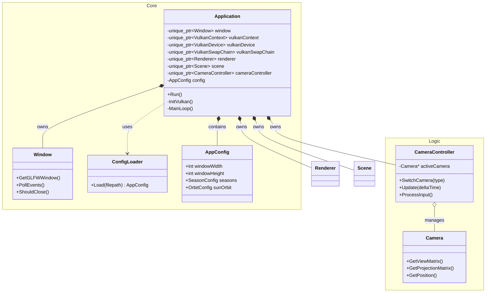
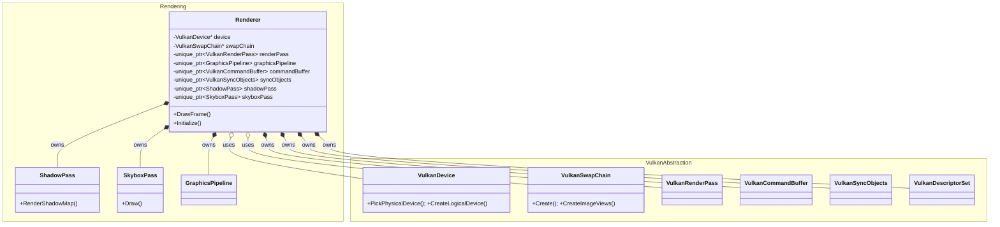
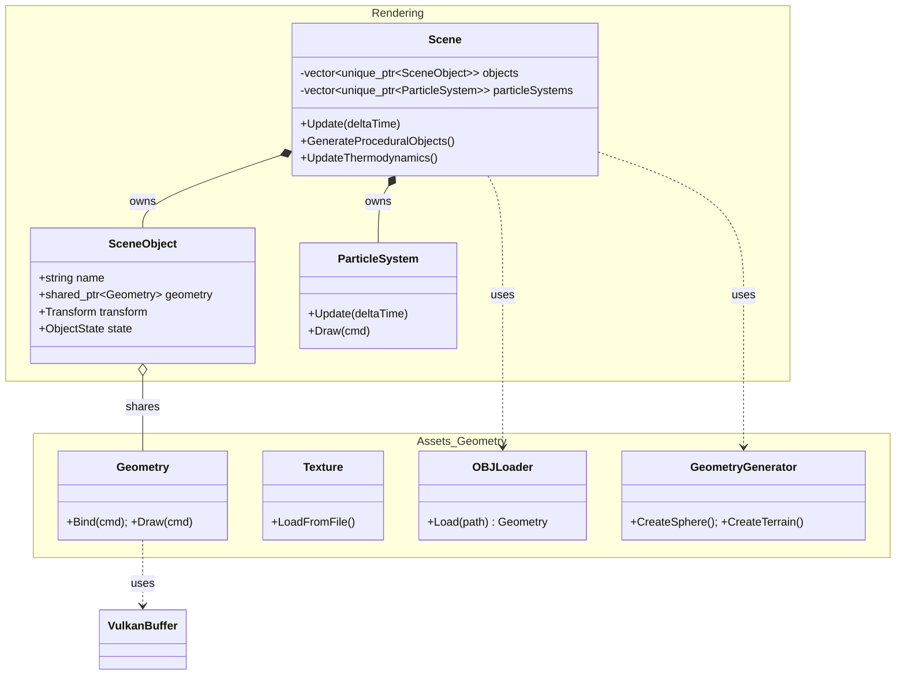
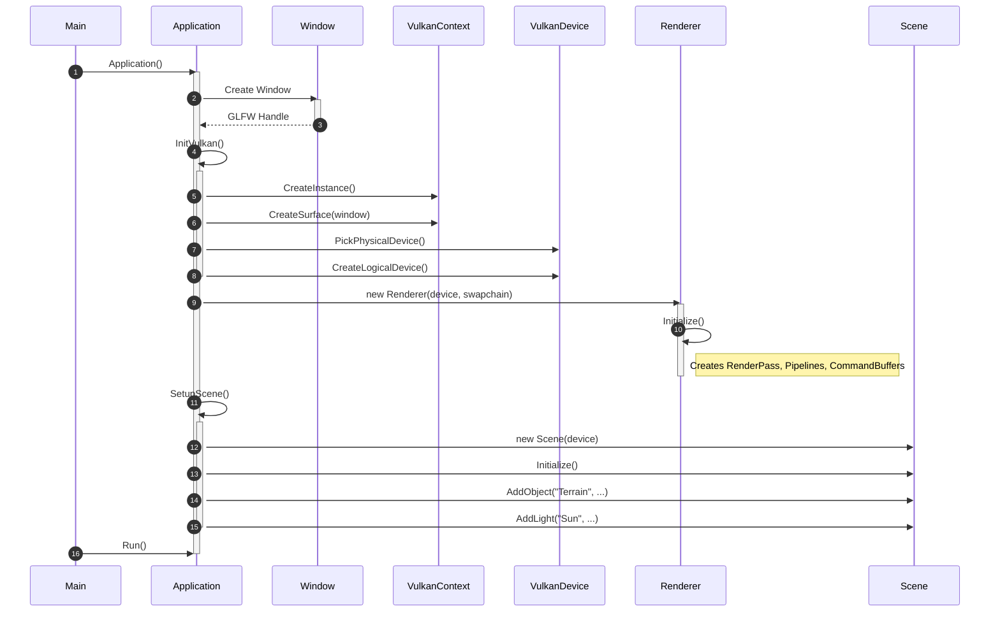
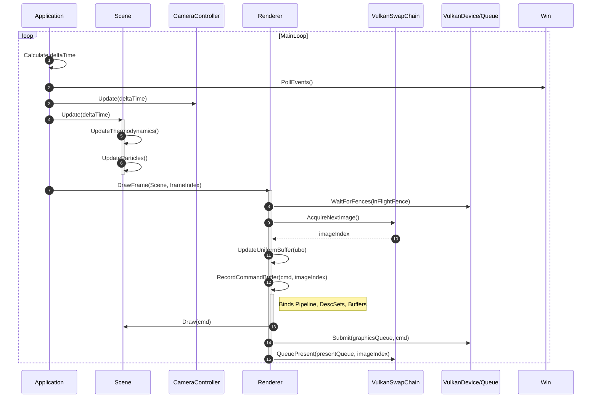

# 700106 / 700120 Lab Book

## Final Lab - The Orb

## Design

| Category | Class Name | Role | Responsibilities |
| :--- | :--- | :--- | :--- |
| **Core System** | `Application` | Main Engine Class | Ties subsystems together (Window, Renderer, Scene); manages the main game loop, time scaling, and cleanup. |
| | `Window` | Windowing Wrapper | Wraps GLFW to create the OS window, handles resizing events, captures input, and manages the Vulkan surface connection. |
| | `ConfigLoader` | Configuration Manager | Loads data-driven settings (window size, seasons, procedural params) from files into the `AppConfig` structure. |
| **Rendering & Scene** | `Renderer` | Pipeline Conductor | Orchestrates the multi-pass rendering (Shadow -> Refraction -> Main); manages frame synchronization and command buffer recording. |
| | `Scene` | World Manager | Central hub for game entities (Terrain, Lights, Objects); handles game logic like seasons, weather, and thermodynamics. |
| | `Camera` | Observer | Maintains position/orientation vectors and calculates View/Projection matrices. |
| | `CameraController` | Input Handler | Translates keyboard/mouse input into camera movement; supports Free Roam and Orbit modes. |
| | `GraphicsPipeline` | State Definition | Configures shaders, vertex input, rasterization, depth testing, and blending. |
| | `SkyboxPass` | Environment Renderer | Renders a cubemap texture to simulate the distant background environment. |
| | `ShadowPass` | Shadow Renderer | Renders the scene depth from the light's perspective into a texture for shadow mapping. |
| | `ParticleSystem` | Effect Manager | Updates and renders particle effects using specific pipelines (additive or alpha-blended). |
| | `ParticleLibrary` | Effect Factory | Provides static helper methods to return pre-configured properties for effects like Fire, Smoke, and Rain. |
| **Geometry & Resources** | `Geometry` | Mesh Wrapper | Manages Vertex and Index buffers in GPU memory and issues draw calls. |
| | `GeometryGenerator` | Mesh Factory | Generates vertex data for primitives (Spheres, Cubes) and procedural terrain. |
| | `OBJLoader` | Asset Importer | Parses `.obj` files to load external 3D models into Geometry objects. |
| | `Texture` | Image Wrapper | Loads 2D images, creates Vulkan image views/samplers, and manages descriptor sets. |
| | `Cubemap` | Texture Wrapper | Loads 6 individual images to create a cube-compatible Vulkan image view. |
| **Vulkan Abstraction** | `VulkanContext` | Root State | Initializes the Vulkan Instance, Debug Messenger, and Window Surface. |
| | `VulkanDevice` | GPU Interface | Selects the Physical Device, creates the Logical Device, and retrieves Graphics/Present queues. |
| | `VulkanSwapChain` | Presentation Manager | Creates the Swapchain and Image Views; handles surface formats and resolution. |
| | `VulkanRenderPass` | Pass Definition | Configures attachments (Color, Depth), subpasses, and dependencies. |
| | `VulkanShader` | Module Loader | Reads SPIR-V binary code and creates `VkShaderModule` objects. |
| | `VulkanCommandBuffer` | Command Manager | Manages the Command Pool and allocates Command Buffers for recording. |
| | `VulkanBuffer` | Memory Manager | Allocates GPU memory for Vertex, Index, or Uniform buffers. |
| | `VulkanDescriptorSet` | Resource Binder | Manages layouts, pools, and sets to allow shaders to access buffers and textures. |
| | `VulkanSyncObjects` | Synchronization | Manages Semaphores and Fences to coordinate CPU-GPU and GPU-GPU execution. |
| | `VulkanUtils` | Helper Library | Provides utilities for common tasks like image creation and layout transitions. |

##
### Core Systems

##
### Rendering Logic

##
### Scene Rendering 

##
### Engine Initialisation Sequence

##
### Frame Rendering

##
### Particle System

```mermaid
sequenceDiagram
    participant Scene
    participant PS as ParticleSystem
    participant Rend as Renderer
    participant Cmd as VkCommandBuffer

    %% Update Step (CPU Simulation)
    rect rgb(30, 30, 30)
    note right of Scene: Logic Update
    Scene->>PS: Update(deltaTime)
    activate PS
    PS->>PS: Emit new particles
    PS->>PS: Update positions/life
    PS->>PS: UpdateInstanceBuffer()
    note right of PS: Maps memory & copies data to GPU
    deactivate PS
    end

    %% Draw Step (GPU Recording)
    rect rgb(50, 20, 20)
    note right of Scene: Render Pass
    Rend->>Scene: RenderScene(cmd)
    activate Scene
    Scene->>PS: Draw(cmd, globalDescSet)
    activate PS
    PS->>Cmd: vkCmdBindPipeline(particlePipeline)
    PS->>Cmd: vkCmdBindDescriptorSets(texture)
    PS->>Cmd: vkCmdBindVertexBuffers(quad + instance)
    PS->>Cmd: vkCmdDrawIndexed(6, particleCount, ...)
    deactivate PS
    deactivate Scene
    end
```

##

### Merits of the Design
The project effectively encapsulates the Vulkan API, with the low-level initialisation details kept in dedicated classes, allowing for improved readability in higher level classes. This means classes such as *Renderer* can focus more on flow and logic, rather than API boilerplate.

The *Application* class acts as a solid root for the ownership hiearchy. By using unique pointers for subsystems likes *Window*, *Renderer* and *Scene*, the design ensures a clear destruction order and prevents memory leaks.

A single point of entry can be used to create the game environment using the *Scene* API, where *Add**X*** commands are ysed to add geometry, models and lighting. Object parameters can be adjusted using the API, with orbit-helpers animating objects and light sources, and layer masks providing scope for light and object visibility. Other common workflows are lifted into helpers, such as toggling weather, shadows and shading. 

Particle setup, model importation and procedural generation processes are all designed to streamline the addition of new content types and effects, without the need to touch the Vulkan layers. The same applies with the seperation of the *Update* and *Draw* logic for rendering, which allows for *Scene* to handle physics/thermodynamics without needing to directly interact with the Vulkan command buffers used in *Renderer*.

Environment simulation is controlled with simple setters, getters and toggles, centeralised at the scene layer. Header files provide a catalogue of parameters, making the process of tuning core mechanics more simplified. Scene specific parameters can be set using a config file, impacting seasons/weather, terrain, procedural genreation and orbit.

### Weaknesses of the Design

The *Scene* class does a lot of heavy lifting, handling environment simulation, particles, thermodynamics, procedural gerneation, orbits, shadow/shading policy and object management. Similarly, the *SceneObject* struct contains rendering data, physics and game state, resulting in many objects being forced to carry the memory overhead of unused fields.

*Renderer* is tighly coupled to specific rendering implementations. It holds direct pointers/instances of the shadow, skybox and particle pipelines. Adding a new pass would mean modifying the header and implementation directly.

Input handling is split between the *Application* and *CameraController*, making it more difficult to identify and modify keybinds.

### What changes could be made and Why?

An entity component system should be used in place of the *SceneObject* struct, splitting the properties into *Transform*, *Rendering*, *Physics*, *Thermodynamics* and *Orbital* components. This would allow for objects to be composed flexibly and would mean that coupling could be reduced in the *Scene* class, creating seperate dedicated systems for each component.

Small configs and builders could be used to prevent the scattering of defaults, with seperate files controlling the scene setup, environement, particle systems, etc. 

Specific pass members could be removed from *Renderer*, in place of a *RenderPass* interface that maintains a list of pass member pointers. This would decouple the renderer from specific effects and allow for the modification of passes at configuration or runtime, without modifying the core class.

An input manager should be used to map physical keys to actions, meaning that other classes can listen for actions instead of direct inputs (i.e. *Action::MOVE_FORWARD*, not *GLFW_KEY_W*).